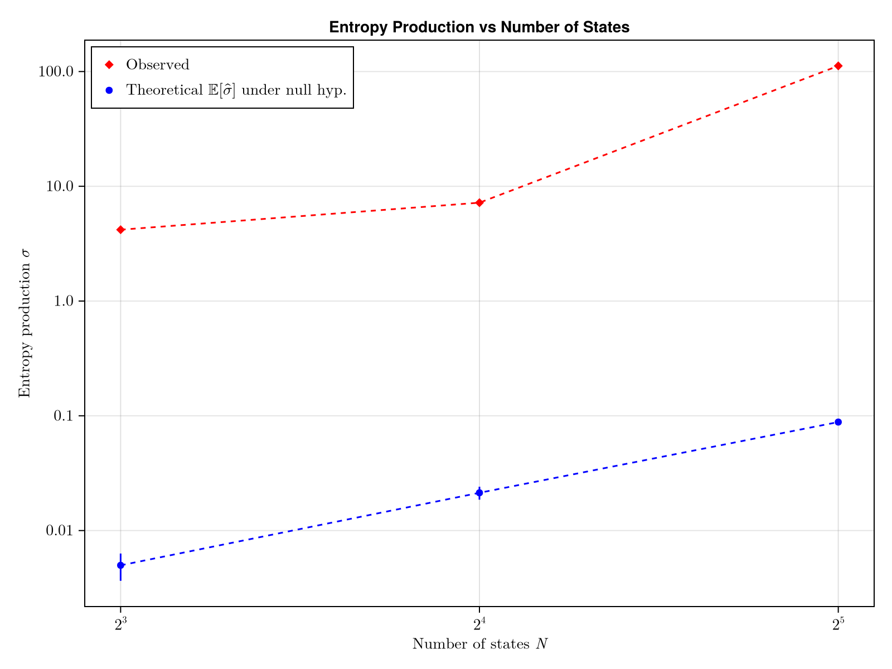
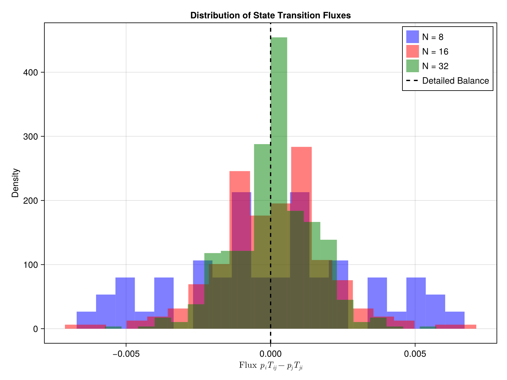
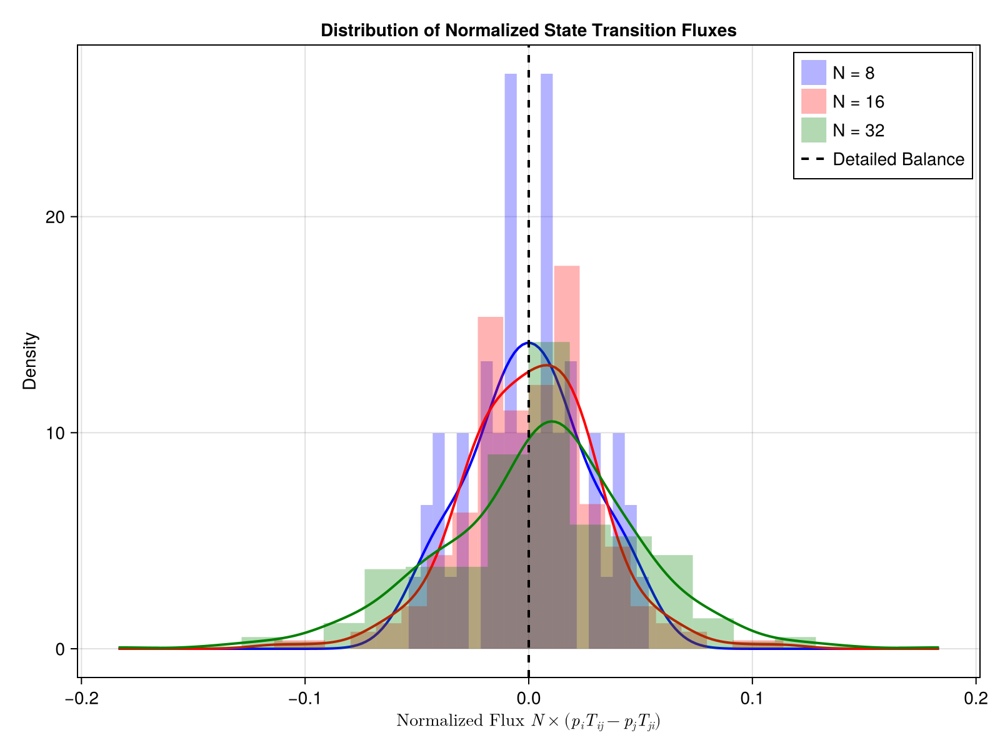

# HMM-RBMs

--

Each state $s$ is represented by one $ \mathbf{h}^s $

Note: there are M hidden vectors

--

Note: HMM parametrized by $S \times S$ matrix and $S \times M$ vectors

--

---

# ARTR
N=500, M=2, S=3

Note: 
ARTR (500 neurons), M=2 donc plottable, S=3  
clusterisation qui prend en compte la dynamique

---

# Brain slice
N=8000, M=20, S=5

Training time: 15 min

--

--

<video controls>
  <source src="figures/slice_S5_data_rec.mp4" type="video/mp4">
</video>

--

---

# Whole brain
N=50k, M=100, S=8

Training time: 1h30

--

--

<video controls>
  <source src="figures/whole_brain_slice_S8_activity_with_viterbi_states.mp4" type="video/mp4">
</video>

--

---

# About entropy

$$ S(t) = -\sum_s P(s, t) \ln P(s, t) $$

--

$$ \frac{\mathrm dS}{\mathrm dt} = \sigma_\text{irr} - \sigma_\text{env} $$

$$ \sigma_\text{irr} = \frac{1}{2} \sum_{s,s'} [P(s,t)T_{ss'} - P(s',t)T_{s's}] \ln \frac{P(s,t)T_{ss'}}{P(s',t)T_{s's}} $$

$$ \sigma_\text{env} = \left\langle \sum_{s'} T_{ss'} \ln \frac{T_{ss'}}{T_{s's}} \right\rangle_{P(s,t)} $$

Note:
Obtained with master equation  
$\sigma_\text{irr}$ is deviation from detailed balance  
$\sigma_\text{env}$ is KL divergence between forward and backward trajectories $\geq 0$

--

In steady state ($\dot S = 0$),  
entropy production quantifies irreversibility

--

Not to confuse with entropy rate $$ \rho = -\frac{1}{T} \sum_{X \in \text{sequences}} P(X) \ln P(X) $$ which measures randomness of sequences.

--

Note: can't really interpret the value itself, but can compare

N=32 : either an artifact / noise, or the model did pick up some irreversibility with 32 states that were not accessible with 16 or 8

--

--

Note: 32 more spread out, consistent with increased entropy production

---

# Remaining work

- More than one $\mathbf{h}^s$ per $s$
  
- Multifish ($\to$ geometrical comparison between individuals)