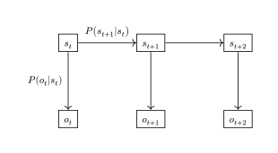
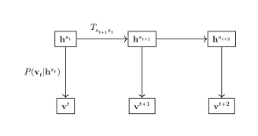
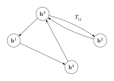
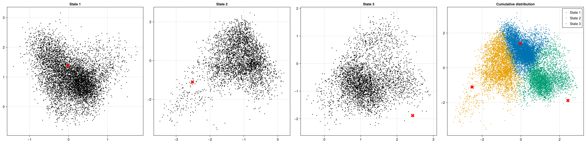
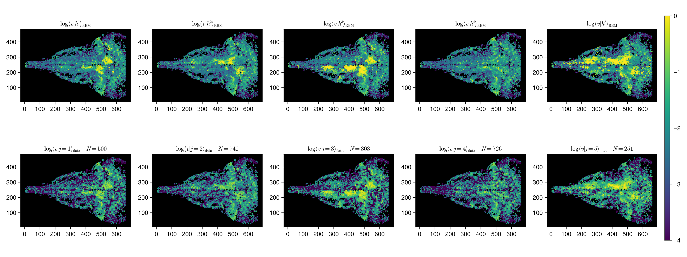
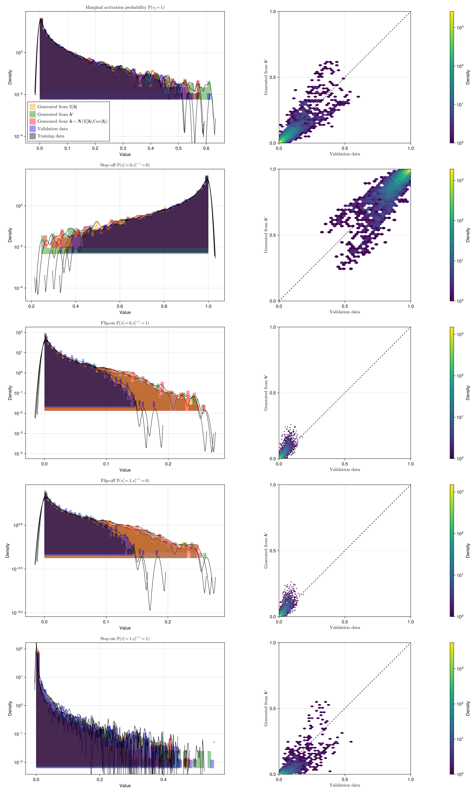
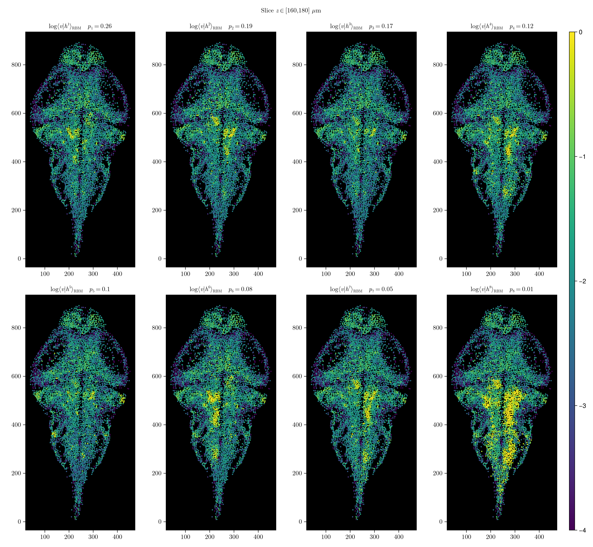
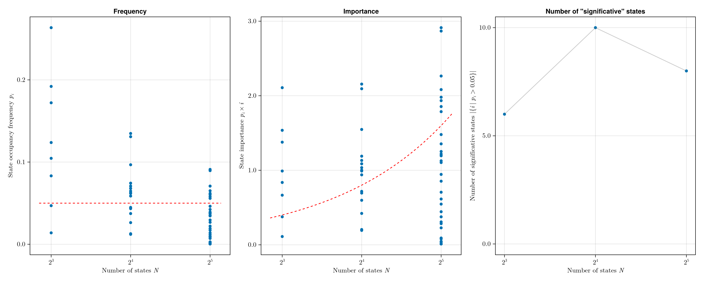

# HMM-RBMs

--

Each state $s$ is represented by one $ \mathbf{h}^s $

Note: there are M hidden vectors

--

Note: HMM parametrized by $S \times S$ matrix and $S \times M$ vectors

--

---

# ARTR
N=500, M=2, S=3

Note: 
ARTR (500 neurons), M=2 donc plottable, S=3  
clusterisation qui prend en compte la dynamique

---

# Brain slice
N=8000, M=20, S=5

Training time: 15 min

--

--

<video controls>
  <source src="figures/slice_S5_data_rec.mp4" type="video/mp4">
</video>

--

---

# Whole brain
N=50k, M=100, S=8

Training time: 1h30

--

--

<video controls>
  <source src="figures/whole_brain_slice_S8_activity_with_viterbi_states.mp4" type="video/mp4">
</video>

--

