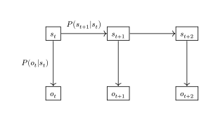
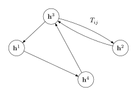
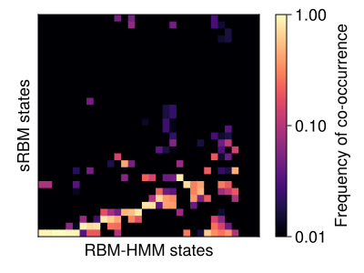
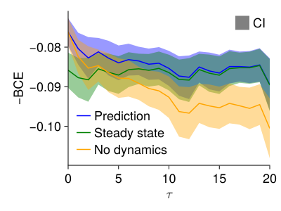
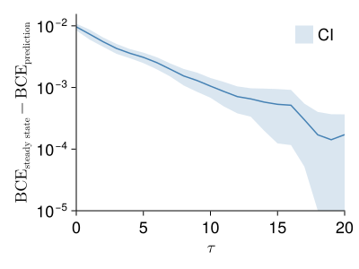
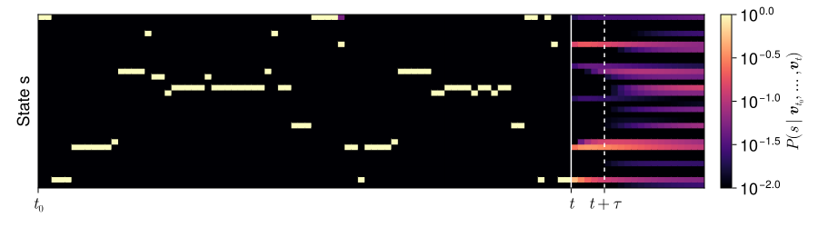
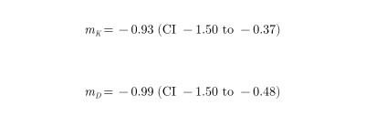
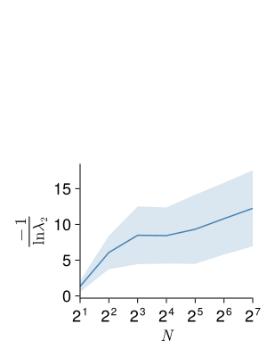
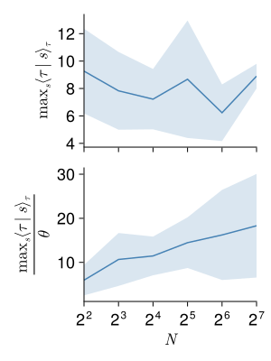

<!-- .slide: data-background-image="figures/cosyne_recap/beach.jpg" -->
<section style="background: rgba(255, 255, 255, 0.7); padding: 20px; border-radius: 50px; display: inline-block;">
<h1>Recap from Cosyne 2026<h1>
</section>
 
--

## Talks
- _Looking inside neural networks with mechanistic interpretability_  
  Chris Olah (Anthropic)
- _The neuroscience of episodic memory in food-caching chickadees_  
  Dmitriy Aronov (Columbia)
- _Time, control, and the nervous system_  
  Joe Paton (Champalimaud)
- _Infection-induced sickness reconfigures brain-wide neural dynamics and behavior in larval zebrafish_  
  X. Yang, Z. Wei, M. Ahrens, A. Ilanges (Janelia HHMI)

Note:
- **Olah:** neuroscientists can have relevant insights into artificial neural networks.  
  Also, "AI can be as dangerous as nuclear weapons" and "we can trust private companies with AI"
- **Aronov:** small bird that hides nuts. It has place cells, but when picking a hiding spot, a very specific activity pattern is observed ("barcode") that has nothing to do with the corresponding place field. This barcode is also active when the bird looks at the hiding spot from a distance.
- **Paton:** the brain doesnt have an independant internal clock. When planning action, it predicts sensory expectations and matches sensory input to these expectations, which gives the sense of time.
- **Yang:** whole brain calcium imaging in larval zebrafish. Sickness causes reorganization of brain dynamics at a large scale: decorrelation between brain regions, sensory network suppressed, less behaviour, and *higher* neural dimmensionality.

--

## Posters
- _Uncovering statistical structure in large-scale neural activity with restricted Boltzmann machines_  
  G. Catania, N. Bereux, A. Decelle, F. Mignacco, A. Gomez, B. Seoane (Madrid)
- _Compositional rules of latent dynamics across timescales explain whole-brain activity during behavior_  
  E. Vickers, M. Johnson, S. Linderman, S. Recanatesi, D. McCormick, L. Mazzucato (Oregon)
- _Area-specific signatures of time-irreversibility in spontaneous neural activity_  
  J. Elpelt, M. Wehrheim, M. Kaschube (Frankfurt)
- _Criticality governs deep learning_  
  S. Vock, C. Meisel (Berlin)

Note:
- **Catania:** RBMs on neuropixel data (2000 neurons, mouse visual system). They want to add a temporal component to the model (TRBM...).
- **Mazzucato:** use factorial HMMs (obs prob depends on several Markov chain states instead of 1) on 10k neurons from mouse cortex to disentangle latent Markov chains operating at different time scales.
- **Elpelt:** quantifies irreversiblity in neuropixel data.
- **Vock:** networks close to criticality (defined as largest lyapunov exponent being close to 0) perform better.

--

## Workshops

- _Renormalization Principles in Neural Systems: From Circuits to Cognition_  
  J. Fernando, G. Petri, A. Santoro, K. Hengen, S. Fusi, K. Harris...
- _Advances in population level perspectives for neural activity perturbations_  
  J. Soldado Magraner, A. Motiwala, E. Oby, Y. Minai, J. Paton, L. Mazzucato...

Note:
- **RG:** when you coarse-grain neural activity (spatially or temporally), what structure is preserved? are neural system at criticality or just close enough? what observables follow power law?  
Connection with RBMs: Mehta & Schwab 2014 (stacking RBMs is equivalent to Kadanoff block spin coarse graining)
- **Perturbations:** when perturbating activity (ex: optogenetics), does activity stay on manifold? Are there preferred directions? can we get causal understanding? points about the importance of behaviour when perturbating

---

# Generative models describe spontaneous brain dynamics across timescales

27/03/2026

---

# Spontaneous brain activity

- ~50 000 recorded neurons
- 30 min @ 2.5 Hz
- 6 fish

Note:
- Not noise: structured, metabolically expensive (~20% of energy budget)
- Constrains how the brain responds to stimuli
- **Goal**: find a common temporal organization across individuals

--

<video data-autoplay data-src="figures/intro/slice_data.mp4" controls style="max-height: 550px; width: auto;"></video>

---

# The HMM-RBM

HMM whose emission distributions are RBMs

--

Each state $s$ is represented by one hidden vector $\mathbf{h}^s$

Note: HMM parametrized by $S \times S$ transition matrix and $S$ hidden vectors

--

Note: The hidden space is partitioned into S regions, one per state. Viterbi decoding assigns each time point to the most likely state.

---

# A shared state vocabulary

Joint training on concatenated data from multiple fish

Note: States are defined in a shared latent space. All individuals share the same repertoire of global brain states — the density peaks overlap perfectly.

--

Note: State maps (spatial patterns of each hidden vector) are consistent across individuals. The species shares the macro-states.

---

# sRBM vs HMM-RBM

Two ways to partition the latent space:
- **sRBM**: stack a second RBM on the hidden layer
- **HMM-RBM**: learn states jointly with Markovian dynamics

Note: Confusion matrix between Viterbi decodings of sRBM and HMM-RBM (N=32, same data). High agreement confirms both methods recover the same underlying state structure.

---

# Predictability

The HMM-RBM is **generative**: it can forecast future brain states.

$$\mathrm{BCE}(t) = -\frac{1}{N} \sum_i \left[ v_i \log \tilde v_i + (1-v_i)\log(1-\tilde v_i) \right]$$

--

Note: Prediction error vs steps ahead, averaged across fish. Model beats both the steady-state baseline and the "no-dynamics" baseline — intrinsic dynamics are truly informative.

--

Note: Gain over steady-state prediction.

--

Prediction time scales logarithmically with $N$

Note: t_pred ~ log(N). Hints at a small-world structure of the transition matrix — and foreshadows the dwell-time story.

--

Note: Example of state sequence prediction on held-out data (N=32, fish Carolinne).

--

Note: Spatial map of prediction accuracy at t+5 steps (fish Marianne). Some brain regions are more predictable than others.

---

# Dwell time distributions

Are state dwell times exponentially distributed (pure Markov)?

Note: Per-state dwell time distributions with exponential fits. Clear deviation from exponential — consistent with a gamma distribution (shape K > 1). This means the state-level dynamics are non-Markovian: the brain "lingers" before switching.

--

Gamma fits: $P(\tau) \propto \tau^{K-1} e^{-\tau/D}$

Note: Average dwell time per state, with gamma fit. Both K and D are well-defined and vary systematically with N.

--

Note: K and D fit values as a function of N. Average dwell time ⟨τ⟩ = KD ~ 1/N — finer partition → shorter visits.

--

## Overall distribution

Note: Aggregating across all states: overall dwell time distribution follows a power law. This is consistent with a mixture of exponentials with gamma-distributed timescales — i.e. the brain operates across a continuum of timescales.

--

## Model–empirical agreement

Note: Predicted vs empirical dwell time statistics. The HMM-RBM reproduces the observed distributions.

---

# Hierarchical timescales

As $N$ increases, states split hierarchically

Note: Mixing times as a function of N. Larger models have longer mixing times — the slow global structure persists.

--

Note: Maximum dwell time vs N — consistent with the log(N) prediction horizon. The slow timescale sets the ceiling for predictability.

---

# Individuality

**Species** shares the macro-states
→ slow global structure, conserved across fish

**Individual** dictates the micro-trajectories
→ fast local computations, unique fingerprint

 

Individuality emerges at finer scales as $N$ increases

Note: The species-level macro-states are the universal scaffold. Individual differences appear in the fine-grained transition dynamics — which micro-state you visit next, and for how long.

---

# Perspectives

- What neural mechanism physically defines dwell times?
- Introduce visual / optogenetic stimuli: does a model trained on spontaneous activity remain predictive of evoked responses?
- Force transitions to target downstream states
- Sparse transition matrix (temperature annealing + threshold)
- HMM with $K > 1$ hidden vectors per state
