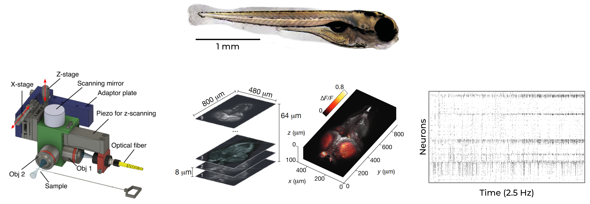
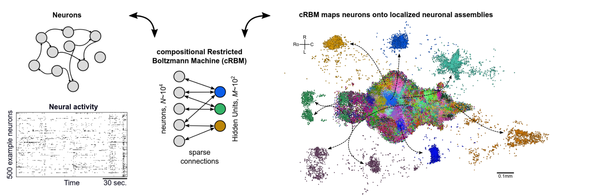
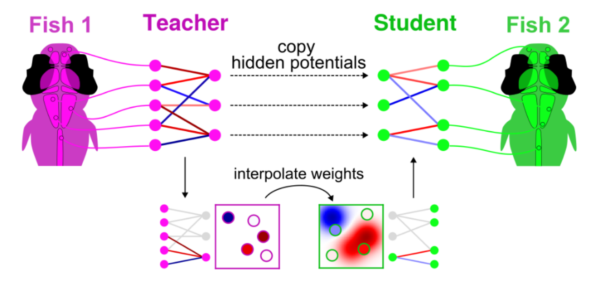
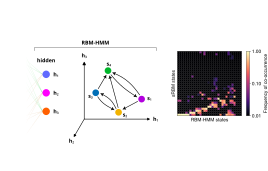
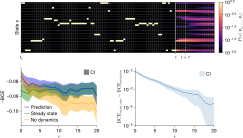
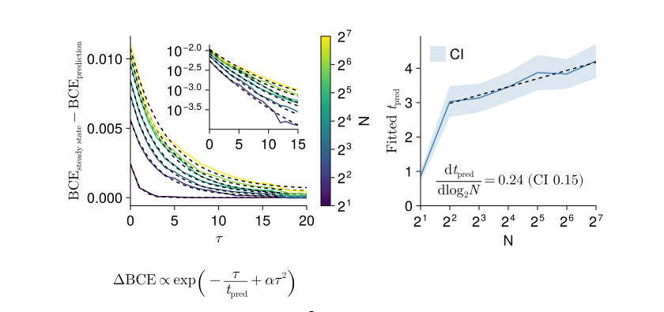
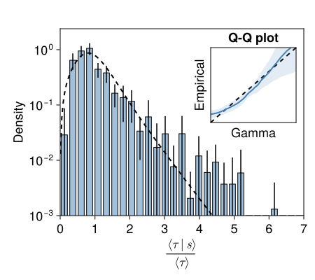
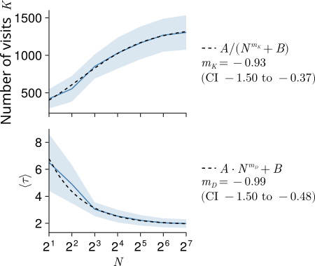
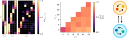
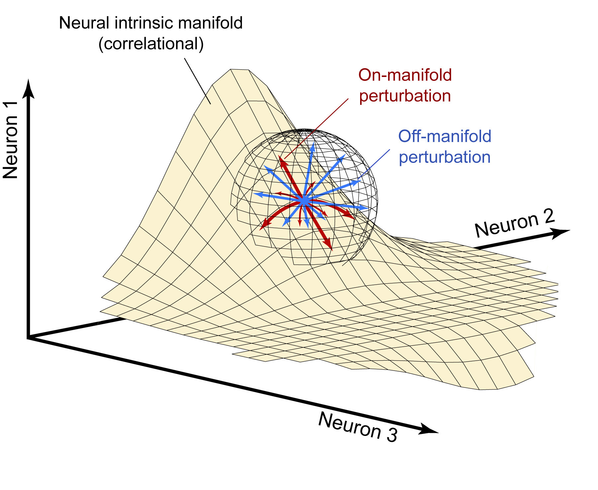

<!-- .slide: data-background-image="figures/cosyne_recap/beach.jpg" -->
<section style="background: rgba(255, 255, 255, 0.7); padding: 20px; border-radius: 50px; display: inline-block;">
<h1>Recap from Cosyne 2026<h1>
</section>
 
--

## Talks
- _Looking inside neural networks with mechanistic interpretability_  
  Chris Olah (Anthropic)
- _The neuroscience of episodic memory in food-caching chickadees_  
  Dmitriy Aronov (Columbia)
- _Time, control, and the nervous system_  
  Joe Paton (Champalimaud)
- _Infection-induced sickness reconfigures brain-wide neural dynamics and behavior in larval zebrafish_  
  X. Yang, Z. Wei, M. Ahrens, A. Ilanges (Janelia HHMI)

Note:
- **Olah:** neuroscientists can have relevant insights into artificial neural networks.  
  Also, "AI can be as dangerous as nuclear weapons" and "we can trust private companies with AI"
- **Aronov:** small bird that hides nuts. It has place cells, but when picking a hiding spot, a very specific activity pattern is observed ("barcode") that has nothing to do with the corresponding place field. This barcode is also active when the bird looks at the hiding spot from a distance.
- **Paton:** the brain doesnt have an independant internal clock. When planning action, it predicts sensory expectations and matches sensory input to these expectations, which gives the sense of time.
- **Yang:** whole brain calcium imaging in larval zebrafish. Sickness causes reorganization of brain dynamics at a large scale: decorrelation between brain regions, sensory network suppressed, less behaviour, and *higher* neural dimmensionality.

--

## Posters
- _Uncovering statistical structure in large-scale neural activity with restricted Boltzmann machines_  
  G. Catania, N. Bereux, A. Decelle, F. Mignacco, A. Gomez, B. Seoane (Madrid)
- _Compositional rules of latent dynamics across timescales explain whole-brain activity during behavior_  
  E. Vickers, M. Johnson, S. Linderman, S. Recanatesi, D. McCormick, L. Mazzucato (Oregon)
- _Area-specific signatures of time-irreversibility in spontaneous neural activity_  
  J. Elpelt, M. Wehrheim, M. Kaschube (Frankfurt)
- _Criticality governs deep learning_  
  S. Vock, C. Meisel (Berlin)

Note:
- **Catania:** RBMs on neuropixel data (2000 neurons, mouse visual system). They want to add a temporal component to the model (TRBM...).
- **Mazzucato:** use factorial HMMs (obs prob depends on several Markov chain states instead of 1) on 10k neurons from mouse cortex to disentangle latent Markov chains operating at different time scales.
- **Elpelt:** quantifies irreversiblity in neuropixel data.
- **Vock:** networks close to criticality (defined as largest lyapunov exponent being close to 0) perform better.

--

## Workshops

- _Renormalization Principles in Neural Systems: From Circuits to Cognition_  
  J. Fernando, G. Petri, A. Santoro, K. Hengen, S. Fusi, K. Harris...
- _Advances in population level perspectives for neural activity perturbations_  
  J. Soldado Magraner, A. Motiwala, E. Oby, Y. Minai, J. Paton, L. Mazzucato...

Note:
- **RG:** when you coarse-grain neural activity (spatially or temporally), what structure is preserved? are neural system at criticality or just close enough? what observables follow power law?  
Connection with RBMs: Mehta & Schwab 2014 (stacking RBMs is equivalent to Kadanoff block spin coarse graining)
- **Perturbations:** when perturbating activity (ex: optogenetics), does activity stay on manifold? Are there preferred directions? can we get causal understanding? points about the importance of behaviour when perturbating

---

# Generative models describe spontaneous brain dynamics across timescales

27/03/2026

---

# Spontaneous brain activity

- ~50 000 recorded neurons
- 30 min @ 2.5 Hz
- 6 fish

Footnote:
Wolf et al. (2015, *Nature Methods*), Panier et al. (2023)

Note:
- Not noise: structured, metabolically expensive (~20% of energy budget)
- Constrains how the brain responds to stimuli
- **Goal**: find a common temporal organization across individuals

--

<video data-autoplay data-src="figures/intro/slice_data.mp4" controls style="max-height: 600px; width: auto;"></video>

---

## Compositionnal Restricted Boltzmann machines

$$P(\mathbf{v}, \mathbf{h}) = \frac{1}{Z}e^{-\beta E(\mathbf{v}, \mathbf{h})} = \frac{1}{Z}\exp\left( \sum_i g_i v_i + \sum_{i,\mu} w_{i\mu} v_i h_\mu - \sum_\mu \mathcal{U}_\mu(h_\mu) \right)$$

Footnote: Van der Plas et al. (2023, *eLife*)

Note:
- Defined as $1 \ll m \ll M$ where $m(t)$ is number of active HUs
- $M \sim 10^2$
- Compositional phase:
  - double-reLU hidden potential
  - $L_1$ regularization on the weights (sparse)
  - Variance of HUs =1, average =0

---
## Latent-aligned RBMs

$\mathcal{L}_\text{Student}=(1-\lambda)\langle \log P(\mathbf{v}) \rangle_\text{Data} + \lambda \langle \log P(\mathbf{h}) \rangle_\text{Teacher}$

Footnote: Dommanget-Kott et al. (2025)

Note: $\lambda=0.5$

--

Footnote: Dommanget-Kott (unpublished)

Note: autocorrelation of hidden units decays after several seconds

---

## State RBM

 
Note:
- a likely state in fish 1 is likely in fish 2
- transitions are not well conserved
Here we cluster, then look at dynamics. Mehta and Schwab: clustering like this is coarse graining, describing the neural activity in terms of a composition of neural assemblies.

One limit of the sRBM: because they must be compositional, state definitions are not independant.

---

## Hidden Markov models

--

## HMM-RBM

Each state $s$ is represented by one hidden vector $\mathbf{h}^s$

Note: HMM parametrized by $S \times S$ transition matrix and $S$ hidden vectors

--

 
Note:
One limit of the sRBM: because they must be compositional, state definitions are not independant.
HMM-RBM states can be defined as any point in latent space.
This results in the RBM-HMM being able to distribute data more evenly between states (higher entropy description).

---

# Predictability

$$\mathrm{BCE} = -\frac{1}{N} \sum_i \left[ v_i \log \tilde v_i + (1-v_i)\log(1-\tilde v_i) \right]$$

Note:
Entropy of super simple case where 1 neuron in 50 is active: 0.1  
Predictability is a good measure of performance  
look at $N$ to see what's best (elbow?)

--

$P^t=\sum_i \lambda_i^t \ket{i} \bra{i}$

$\text{Score}(t) = \bra{f} P^t \ket{\rho_0} - \braket{f|\pi}$

$= \sum_{i \geq 2} \alpha_i \exp(t \ln \lambda_i)$

Note:
Score depends on a mixture of exponentials of different scales.  
These scales (eigen values of P) are related to dwell times.

--

Prediction time scales logarithmically with $N$

Note:
We don't get an elbow, we get a clean log (except $N=2$, the only reversible model). Let's try to understand this log.

---

## Dwell times in each state

<!-- Are state dwell times exponentially distributed (pure Markov)? -->

<!--  -->

Note: P-P plot: plots two CDF against each other

--

## Average dwell times

<!-- $P(\tau) \propto \tau^{K-1} e^{-\tau/D}$ -->

Note:
Q-Q plot: quantile-quantile  
Histogram computed from data, but very good agreement with transition matrix.

--

## Overall distribution

Footnote:
$/\mkern-5mu/$ Ponce-Alvarez et al. (2018, *Neuron*), Wang et al. (2025, *eLife*)

Note: Aggregating across all states: overall dwell time distribution follows a power law. This is consistent with a mixture of exponentials with gamma-distributed timescales — i.e. the brain operates across a continuum of timescales.  

German Sumbre paper: Whole-Brain Neuronal Activity Displays Crackling Noise Dynamics 

Quan Wen: The Geometry and Dimensionality of Brain-wide Activity (sample random subsets of neurons to see what changes with scale, find that the structure of the covariance is scale invariant)

---

But where does the $\log N$ come from?

Note:
It depends on the largest eigen value: how fast does the markov chain mix (ie decay to steady state)?

--

Note:
Extreme value theory on characteristic time for each state: $\tau_\text{max} \propto \theta \log N$ for Gamma dist with $N$ samples.  
But the scale parameter shrinks, so it does not explain the log. So the log must come from the state space getting larger (small world network).

--

<!-- ## Fast dynamics in bigger models -->

Note:
What we also get is that the larger the model, the faster the dynamics.

---

## Hierarchical states

$$I(S; B) = D_{KL}(p_{SB} \Vert p_S p_B)$$

Note:
Small=few states, big = detailed.  
Score how much knowledge of the small model you have when you know the big model state.  
Good score = very hierarchic.  
Increasing $N$ = states split into more detailed states.

---

## Individuality emerges at finer scales

Note:
Gray line = one pair of 2 fish.  
Compare transition matrices.

By describing the data at different scales, we find that the brain operates at different time scales: a "slow" global structure, well conserved across individuals, that orchestrates "fast" local computations.

---

# Perspectives

 <!-- .element: style="width:25%" -->
 <!-- .element: style="width:50%" -->

Footnote:
Image from Jazayeri & Afraz (2017, *Neuron*)

Note:
- Visual stimuli and optogenetic perturbations: are we still predictive? 
- Optogenetics: can we force the system to go where we want? Luca Mazzucato: perturbation result does not depend on starting point.
