# Optogenetic and computational interrogation of metastable brain states in larval zebrafish

## Second year thesis advisory committee

Guillaume Faye-Bédrin 

16/06/2026

---

# Context

---

## Whole-brain imaging in larval zebrafish

  

  
<video data-autoplay loop muted data-src="figures/context/LSM.mp4" style="max-width:100%; max-height:100%;"></video>

  

Footnote:
Wolf et al. (2015, *Nature Methods*), Panier et al. (2023)

Note:
- Whole-brain light-sheet imaging of larval zebrafish, pan-neuronal GCaMP
- fluorescence → deconvolved / binarized events → ~50 k-neuron raster
- ~50 000 neurons, 30 min @ 2.5 Hz, 6 fish

---

## First year question:

Can we predict optogenetics experiments?

  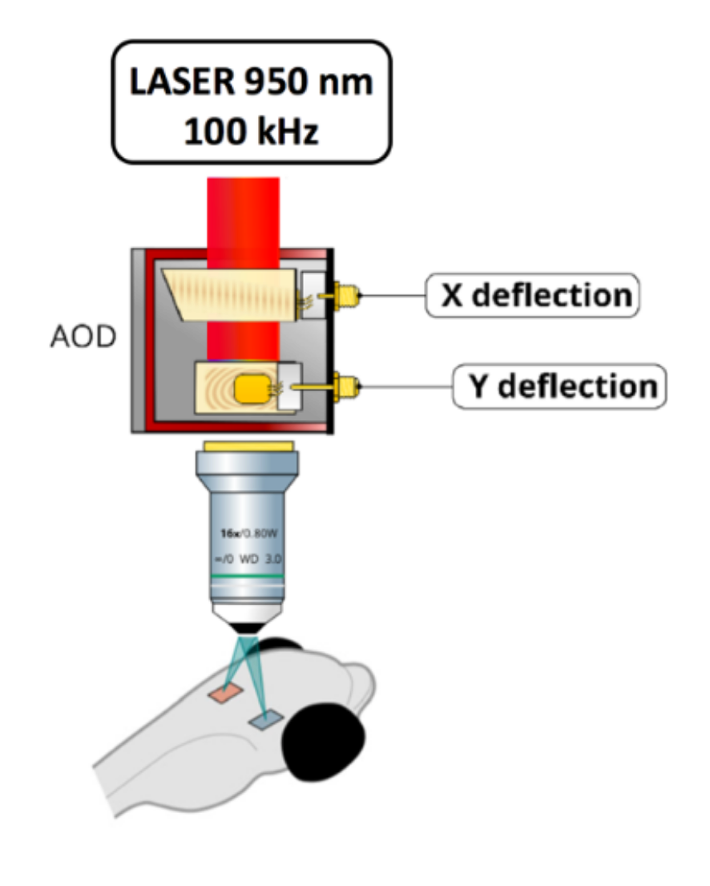
  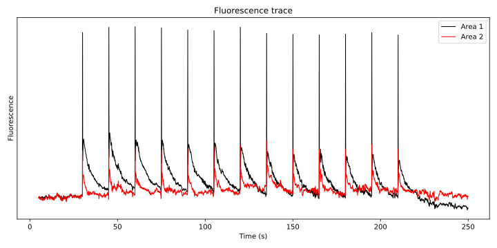
  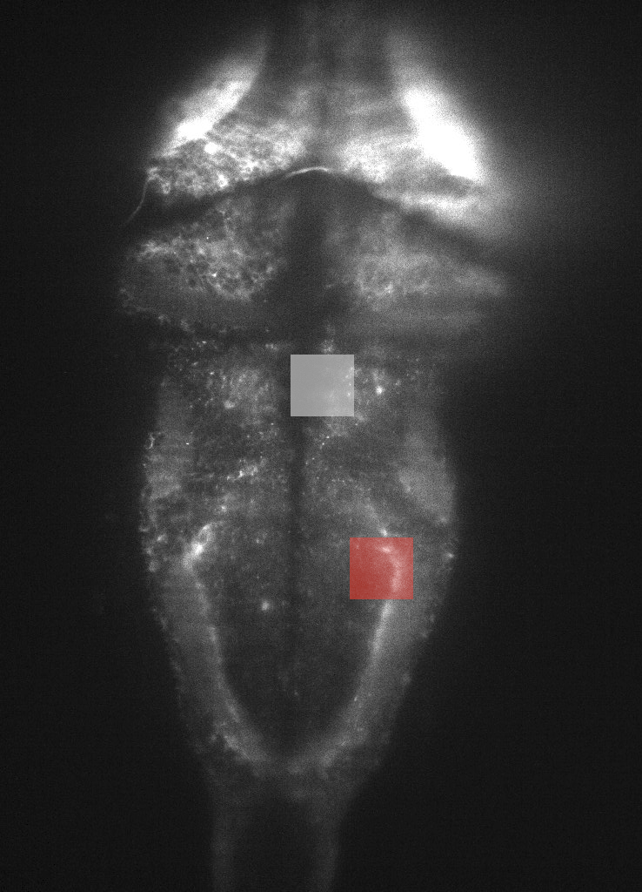

$\rightarrow$ Motivates dynamical models

Footnote: Hubert et al. (2023, *Advances in Microscopic Imaging IV*); data from Clémence Eluère

---

## Learning from spontaneous activity

<video data-autoplay loop muted data-src="figures/context/Movie1.mp4" style="max-height:560px; width:auto; display:block; margin:10px auto;"></video>

Note:
- Not noise: structured, metabolically expensive (~20% of energy budget)
- Constrains how the brain responds to stimuli
- We model the distribution P(v) of brain configurations (Boltzmann) → next: RBMs
- **Goal**: find a common temporal organization across individuals

---

## Restricted Boltzmann Machines

Footnote: Van der Plas et al. (2023, *eLife*)

Note:
- Defined as $1 \ll m \ll M$ where $m(t)$ is number of active HUs
- $M \sim 10^2$
- Compositional phase:
  - double-reLU hidden potential
  - $L_1$ regularization on the weights (sparse)
  - Variance of HUs =1, average =0

---

## RBMs reveal cell assemblies

  

    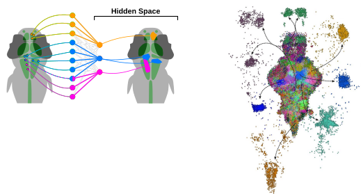
    

      <figure style="margin:0;"><figcaption style="font-size:0.42em;">Thijs van der Plas</figcaption></figure>
      <figure style="margin:0;"><figcaption style="font-size:0.42em;">Jérôme Tubiana</figcaption></figure>
    

  

Footnote: Van der Plas et al. (2023, *eLife*)

Note: RBM weights group co-active neurons into cell assemblies that map onto known functional circuits.

---

## Aligning latent spaces across fish

  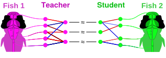
  

    <figure style="margin:0;"><figcaption style="font-size:0.42em;">Mattéo Dommanget-Kott</figcaption></figure>
    <figure style="margin:0;"><figcaption style="font-size:0.42em;">Jorge Fernández de Cossío Díaz</figcaption></figure>
  

Footnote: Dommanget-Kott et al. (2026, *PNAS*)

Note: Teacher RBM on fish 1; student RBM on fish 2 aligned to the teacher's latent space ($\lambda=0.5$).

---

Note: autocorrelation of hidden units decays after several seconds

---

## Modeling the dynamics with an HMM

--

## The HMM-RBM

Each state $s$ is represented by one hidden vector $\mathbf{h}^s$

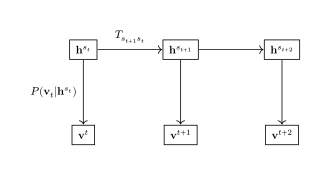

Note: HMM parametrized by $S \times S$ transition matrix and $S$ hidden vectors

--

 
Note:
One limit of the sRBM: because they must be compositional, state definitions are not independant.
HMM-RBM states can be defined as any point in latent space.
This results in the RBM-HMM being able to distribute data more evenly between states (higher entropy description).

---

## Per-state dwell times are exponential

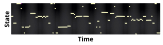

<!-- Are state dwell times exponentially distributed (pure Markov)? -->

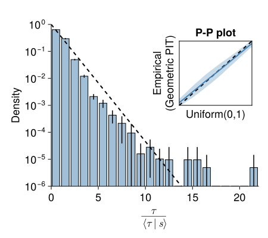
<!--  -->

Note: P-P plot: plots two CDF against each other

--

## Average dwell times follow an inverse Gamma

<!-- $P(\tau) \propto \tau^{K-1} e^{-\tau/D}$ -->

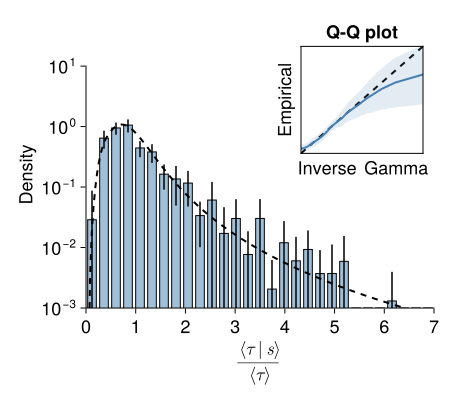
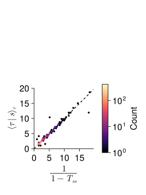

Note:
Q-Q plot: quantile-quantile  
Histogram computed from data, but very good agreement with transition matrix.

--

## Overall dwell times follow a power law

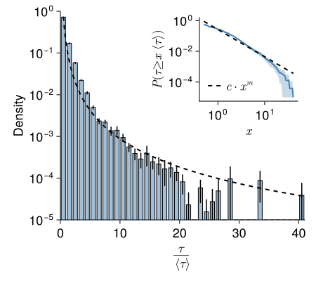

Footnote:
$/\mkern-5mu/$ Ponce-Alvarez et al. (2018, *Neuron*), Wang et al. (2025, *eLife*)

Note: Aggregating across all states: overall dwell time distribution follows a power law. This is consistent with a mixture of exponentials with gamma-distributed timescales — i.e. the brain operates across a continuum of timescales.  

German Sumbre paper: Whole-Brain Neuronal Activity Displays Crackling Noise Dynamics 

Quan Wen: The Geometry and Dimensionality of Brain-wide Activity (sample random subsets of neurons to see what changes with scale, find that the structure of the covariance is scale invariant)

---

## How predictable are the dynamics?

$$\mathrm{BCE} = -\frac{1}{N} \sum_i \left[ v_i \log \tilde v_i + (1-v_i)\log(1-\tilde v_i) \right]$$

Note:
Entropy of super simple case where 1 neuron in 50 is active: 0.1  
Predictability is a good measure of performance  
look at $N$ to see what's best (elbow?)

Prediction time scales logarithmically with $N$

---

## All model sizes share a common time-scale distribution

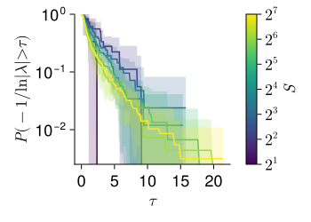

Note:
All model sizes sample the **same** distribution of time scales — its exponential tail makes the largest of $S$ draws grow as $\log S$, so prediction time ∝ $\log S$

- $x$-axis: relaxation time scale $\tau = -1/\ln\lambda$ of each transition-matrix eigenvalue $\lambda$; curve = CDF $P(\tau \le \cdot)$.
- Curves for $S = 2^1 \dots 2^7$ collapse → the underlying time-scale distribution is **size-independent**.
- Extreme-value: the maximum of $S$ i.i.d. draws from a distribution with an exponential tail grows like $\log S$.
- Prediction horizon is set by the slowest surviving mode (largest $\tau$) ⇒ $t_\text{pred} \propto \log S$ — explaining the empirical $\log N$ scaling.

---

## Individuality emerges at finer scales

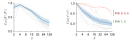

Note:
Gray line = one pair of 2 fish.  
Compare transition matrices.

By describing the data at different scales, we find that the brain operates at different time scales: a "slow" global structure, well conserved across individuals, that orchestrates "fast" local computations.

---

## Summary

  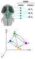
  

  

    <ul>
      <li>Interest in predicting optogenetics outcomes</li>
      <li>Motivated a dynamical model of brain activity</li>
      <li>Enabled to show structure in spontaneous activity</li>
    </ul>
  

Note:
- Predictive is not a goal in itself, it's a check that the model is good
- Spontaneous activity is structured, not noise
- How conserved it is depends on the description scale
- Fine enough to identify siblings from spontaneous activity

---

Note:
- Visual stimuli and optogenetic perturbations: are we still predictive? 
- Optogenetics: can we force the system to go where we want? Luca Mazzucato: perturbation result does not depend on starting point.

---

## Planning from last year

---

## What's next?

- Produce datasets with evoked or stimulated activity, and apply the model
- Analyse datasets from other lab members (zebrafish, danionella, with various stimuli: visual, vestibular...)

--- 

## Conferences

- *Maturation and Plasticity in Biological and Artificial Neural Networks*, Cargèse, 2024
- *GDR NeuralNet*, Bordeaux, 2025 - Poster
- *Cosyne*, Lisbon, 2026 - Poster
- *Approches quantitatives du vivant*, Aussois, 2026 - Poster

Future:
- *Bernstein Computational Neuroscience*, Frankfurt, 2026 - Applied for a talk

---

## Training

- Animal experimentation: 57h
- Cargèse 2026: 20h
- Rendre son sujet accessible: 8h
- Training for Chargé de mission d'enseignement: 17h

Note:
Teaching:
- mission 128h
- 60h TP informatics for physics L2
- 20h TD mechanics L1
Next year:
- 28h TP optics L3
- Missing 20h

---

## Professional plan

- Stay in research, in biophysics, working with theoretical/computational tools
- Exact domain unclear

<strong>General idea:</strong>

- Defend in fall 2027
- Postdoc ~18 months in Europe
- Postdoc in France to apply for CNRS

Note:
- After defense, leave for a postdoc
- Marie Curie deadline in early september: should i panic?

---

# Supplementary

---

## A state RBM discretizes the dynamics

 
Note:
- a likely state in fish 1 is likely in fish 2
- transitions are not well conserved
Here we cluster, then look at dynamics. Mehta and Schwab: clustering like this is coarse graining, describing the neural activity in terms of a composition of neural assemblies.

One limit of the sRBM: because they must be compositional, state definitions are not independant.

--

## State sequences are Markovian enough

  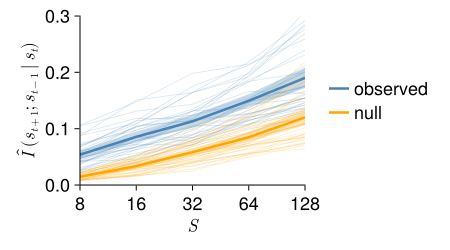
  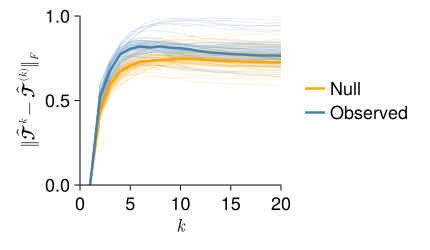

$$\hat I(s_{t+1};\, s_{t-1}\mid s_t) \;=\; \sum_{i,j} \hat P(i,j)\; D_{\mathrm{KL}}\!\left(\hat{\mathcal T}^{(2)}_{ij,\cdot}\,\big\|\,\hat{\mathcal T}_{j,\cdot}\right)$$

Note:
- Observed sequences stay close to the Markov null → dynamics are first-order → an HMM is justified.
- The sRBM assigns each time point a state, giving a discrete state sequence $s_t$.
- **Left — Chapman–Kolmogorov:** $\|\hat{\mathcal T}^{k} - \hat{\mathcal T}^{(k)}\|_F$, the $k$-step matrix predicted from one-step transitions vs. the directly estimated $k$-step matrix. Observed (blue) barely exceeds the Markov null (orange).
- **Right:** conditional MI $\hat I(s_{t+1}; s_{t-1}\mid s_t)$ — exactly 0 for a perfect first-order chain. Small observed–null gap; the growth with $S$ is finite-sample bias (present in the null too).
- Both diagnostics: only a tiny departure from Markovianity ⇒ describing the dynamics with a Hidden Markov Model is justified.