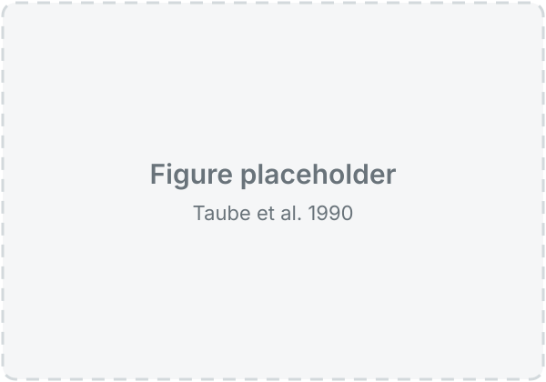
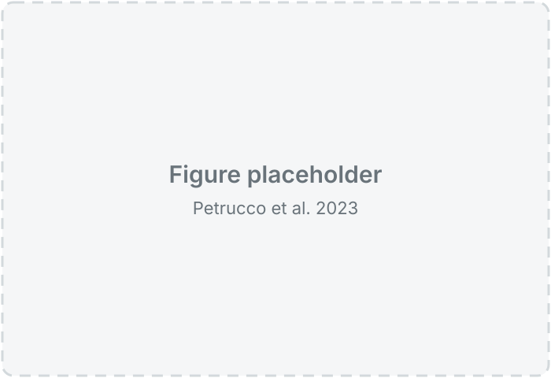

# Exploring the head direction circuit in *Danionella cerebrum*

Manon's project overview

---

## How does a brain keep an internal sense of direction, even in the dark?

---

## Neurons that encode space

  <figure style="margin:0; width:42%;">
    
    <figcaption style="font-size:0.45em; margin-top:10px;">Place cells: hippocampus, rat</figcaption>
  </figure>
  <figure style="margin:0; width:42%;">
    
    <figcaption style="font-size:0.45em; margin-top:10px;">Head direction cells: postsubiculum, rat</figcaption>
  </figure>

Footnote: O'Keefe & Dostrovsky (1971, *Brain Research*); Taube, Muller & Ranck (1990, *J. Neurosci.*)

Note:
- Place cells fire when the animal is at one location in the environment
- Head direction cells fire when the head points in one direction, wherever the animal is
- HD tuning persists in darkness: the signal is maintained internally, not just read from vision

---

## The ring attractor

Footnote: Skaggs et al. (1995, *NeurIPS*); Zhang (1996, *J. Neurosci.*)

Note:
- Neurons arranged by preferred direction (a functional ring, not necessarily anatomical)
- Local excitation + global inhibition → a single stable bump of activity
- Bump position = heading; with no input it persists (memory)
- Angular velocity input pushes the bump around the ring → path integration

---

## A ring attractor in the fly, in the dark

<video data-autoplay loop muted data-src="figures/intro/seelig2015_video6.mp4" style="max-height:540px; width:auto; display:block; margin:10px auto;"></video>

Footnote: Seelig & Jayaraman (2015, *Nature*), Supplementary Video 6

Note:
- Head-fixed *Drosophila* walking on a ball in darkness, 2-photon GCaMP6f imaging of E-PG neurons in the ellipsoid body
- A single bump of activity travels around the ellipsoid body
- Accumulated bump position (red) follows accumulated ball rotation (blue): angular path integration without visual cues
- Playback at 2× speed

---

## A heading network in zebrafish

  
  <ul style="width:44%; font-size:0.7em;">
    <li>Light-sheet imaging: a topographic heading code in the anterior hindbrain</li>
    <li>A sinusoidal activity bump rotates with directional swims, and is otherwise stable for many seconds</li>
    <li>EM: these neurons arborize in the interpeduncular nucleus, where reciprocal inhibition stabilizes the ring</li>
  </ul>

Footnote: Petrucco et al. (2023, *Nature Neuroscience*)

Note:
- First vertebrate heading circuit whose connectivity is known
- Same architecture principles as the fly central complex
