# Exploring the head direction circuit in *Danionella cerebrum*

Manon's project overview

---

## Path integration

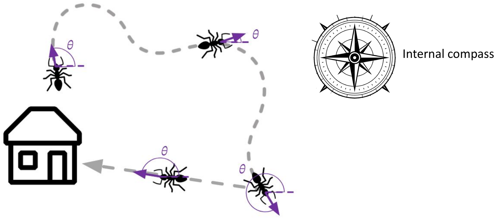

Note:
- A desert ant leaves its nest on a winding foraging path, then heads straight home
- To do that it must keep track of its heading (θ) and distance at every step, and sum them: path integration
- This needs an internal compass: a signal for heading that is maintained by the brain itself

---

## How does a brain keep an internal sense of direction, even in the dark?

---

  <figure style="margin:0; width:400px;">
    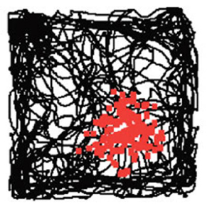
    <!-- <figcaption style="font-size:0.5em; margin-top:8px;">Place cells: hippocampus, rat</figcaption> -->
    Paper: The hippocampus as a spatial map. Preliminary evidence from unit activity in the freely-moving rat | O'Keefe & Dostrovsky, *Brain Research*, 1971
  </figure>
  <figure style="margin:0; width:400px;">
    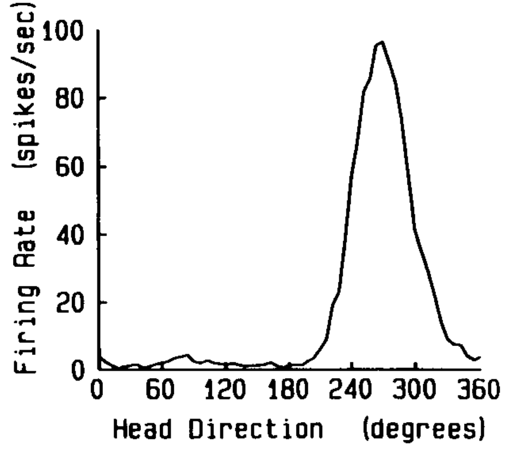
    <!-- <figcaption style="font-size:0.5em; margin-top:8px;">Head direction cells: postsubiculum, rat</figcaption> -->
    Paper: Head-direction cells recorded from the postsubiculum in freely moving rats. | Taube, Muller & Ranck, *J. Neurosci.*, 1990
  </figure>

<!-- Footnote: Left: place field adapted from Jeffery et al. (2015, *Front. Psychol.*), CC BY 4.0. Right: Taube et al. (1990), Fig. 3C -->

Note:
- Left: rat's path in a square arena (black), spikes of one CA1 cell (red) cluster in one place = place field
- Right: one postsubiculum cell, firing rate vs head direction: ~100 Hz near 270°, silent elsewhere (~90° wide)
- Place cells fire when the animal is at one location in the environment
- Head direction cells fire when the head points in one direction, wherever the animal is
- HD tuning persists in darkness: the signal is maintained internally, not just read from vision

---

## The ring attractor

  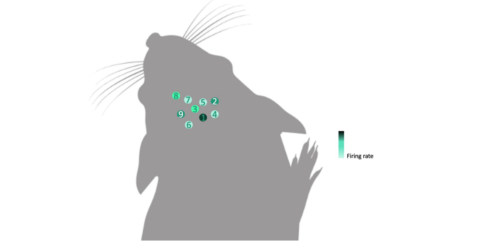
  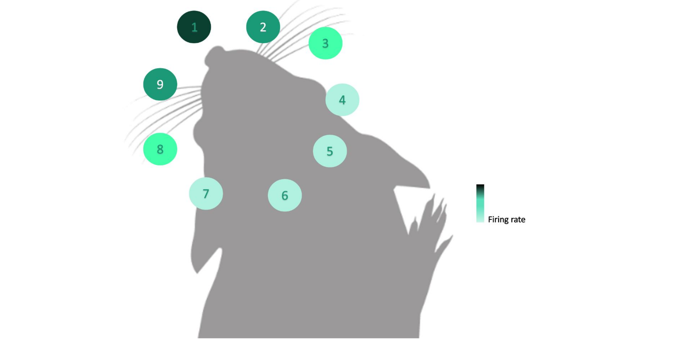
  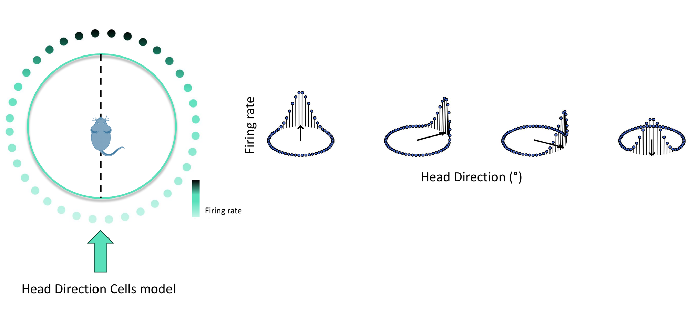
  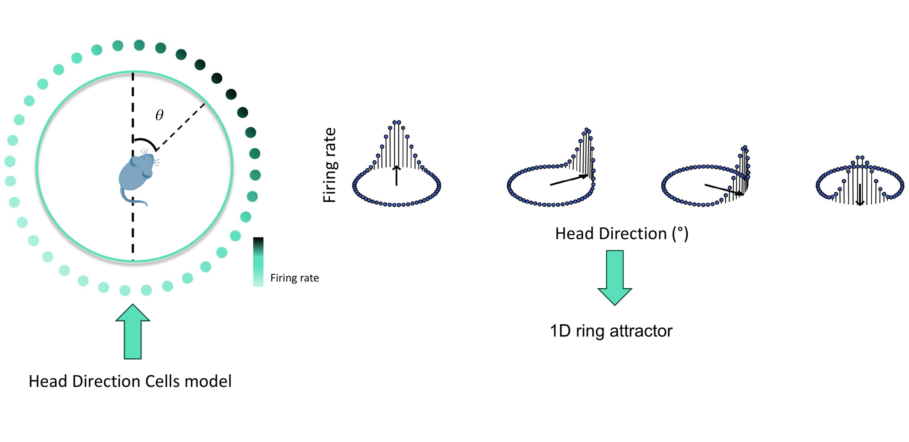
  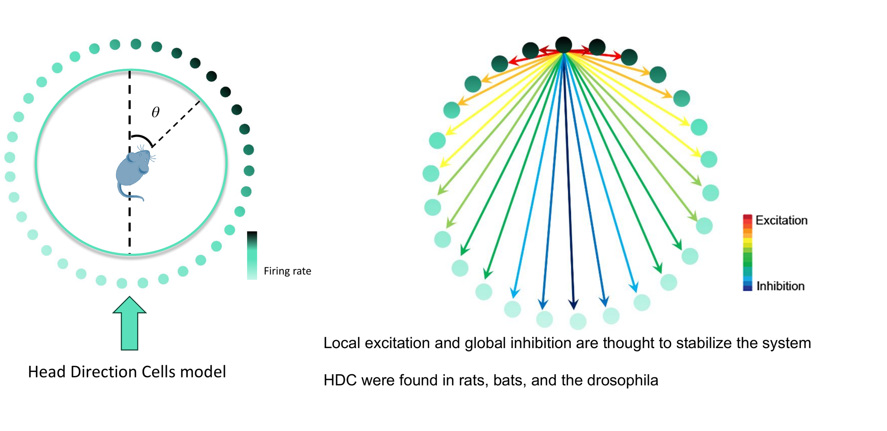

  Paper: A model of the neural basis of the rat's sense of direction | Skaggs, Knierim, Kudrimoti & McNaughton, *NeurIPS*, 1995
  Paper: Representation of spatial orientation by the intrinsic dynamics of the head-direction cell ensemble: a theory | Zhang, *J. Neurosci.*, 1996

Note:
- Step 1: head direction cells in the rat brain; each one fires most when the head points in its preferred direction
- Step 2: in the brain they are not ordered by preferred direction (anatomy is scrambled)
- Step 3: arrange them on a ring by preferred direction: as the animal turns, the activity bump moves around the ring. Tuning curves: firing rate vs head direction
- Step 4: this is a 1D ring attractor; bump position = heading θ
- Step 5: local excitation and global inhibition stabilise a single bump. With no input it persists (memory); angular velocity input pushes it around (path integration)
- HD cells were found in rats, bats and *Drosophila*
---

<video data-autoplay loop muted data-src="figures/intro/seelig2015_video6.mp4" style="max-height:440px; width:auto; display:block; margin:10px auto;"></video>

Paper: Neural dynamics for landmark orientation and angular path integration | Seelig & Jayaraman, *Nature*, 2015

Note:
- Head-fixed *Drosophila* walking on a ball in darkness, 2-photon GCaMP6f imaging of E-PG neurons in the ellipsoid body
- A single bump of activity travels around the ellipsoid body
- Accumulated bump position (red) follows accumulated ball rotation (blue): angular path integration without visual cues
- Playback at 2× speed

---

  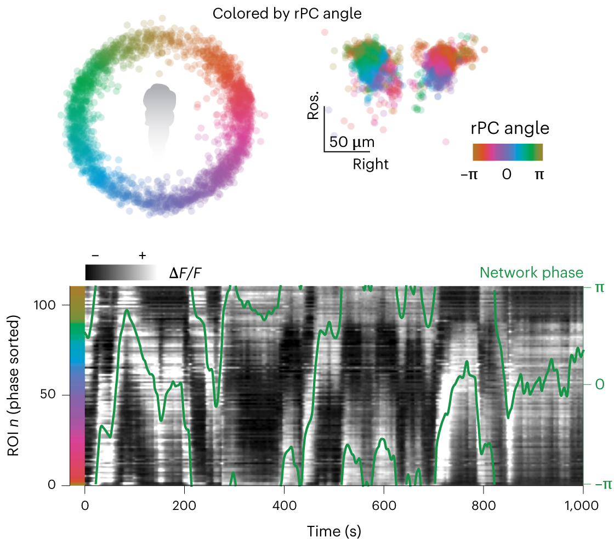
  

    Paper: Neural dynamics and architecture of the heading direction circuit in zebrafish | Petrucco et al., *Nature Neuroscience*, 2023
    <ul style="font-size:0.7em;">
      <li>Topographic heading code in the anterior hindbrain</li>
      <li>The bump rotates with directional swims</li>
      <li>Reciprocal inhibition in the IPN stabilises the ring</li>
    </ul>
  

Footnote: Petrucco et al. (2023), Fig. 1g–h, CC BY 4.0

Note:
- Figure top: r1π neurons (GABAergic, anterior hindbrain) projected on the first two rotated PCs form a ring; colour = angle on the ring. Same colours on the anatomy: a topographic map across both hemispheres
- Figure bottom: activity of ~100 neurons sorted by ring angle over 1000 s; the bright bump moves across the population, and the network phase (green) follows it
- Bump is otherwise stable for many seconds between swims
- EM: these neurons arborize in the interpeduncular nucleus (IPN), with reciprocal inhibition
- First vertebrate heading circuit whose connectivity is known
- Same architecture principles as the fly central complex

---

  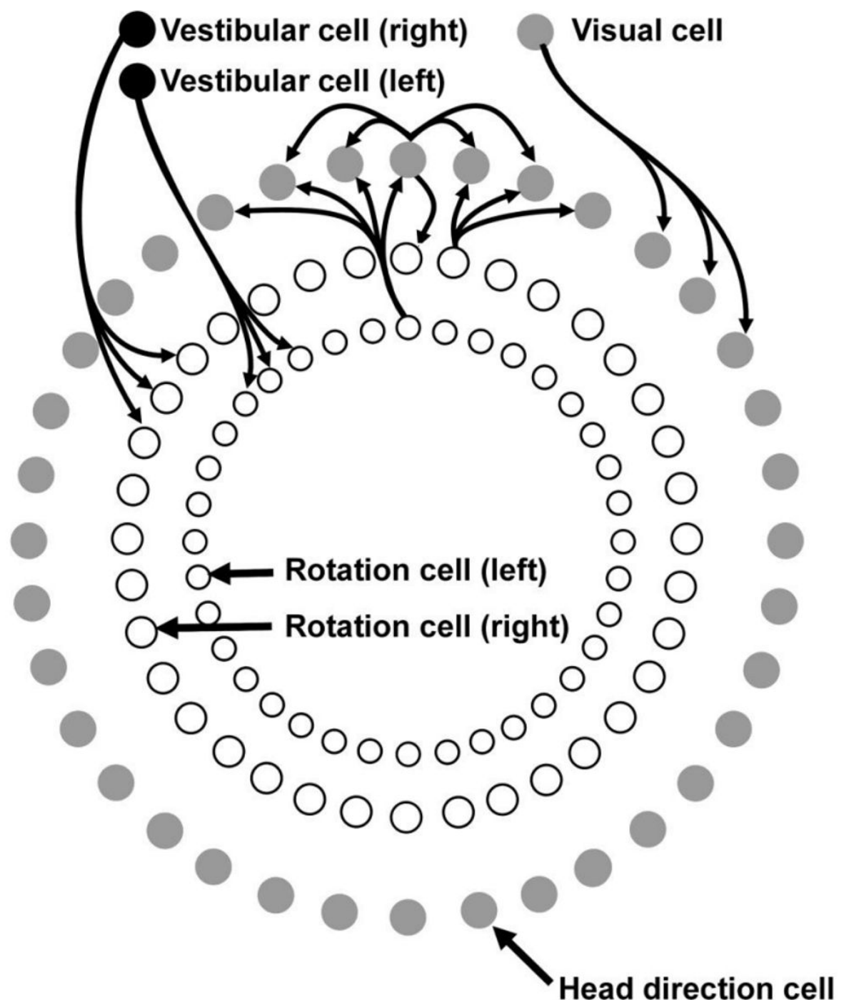
  

    <ul style="font-size:0.7em;">
      <li>Inputs: vestibular, visual, proprioceptive, auditory, olfactory…</li>
    </ul>
    <ul class="fragment" style="font-size:0.7em; margin-top:24px;">
      <li>How are these cues integrated?</li>
      <li>How does the circuit mature?</li>
    </ul>
  

Footnote: Schematic after Skaggs et al. (1995)

Note:
- Outer ring (grey): head direction cells. Inner rings: rotation cells (left/right), driven by vestibular cells, shift the bump. Visual cells anchor the ring to landmarks
- The zebrafish circuit was found in 7–9 dpf larvae; nothing is known about how it matures
- Zebrafish become opaque and too big for whole-brain imaging after ~2 weeks, so we need another animal

---

## *Danionella cerebrum*: a new animal model

  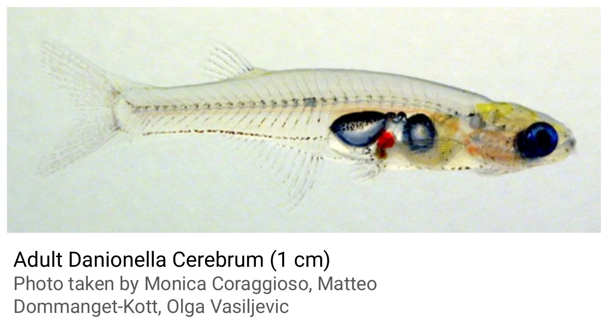
  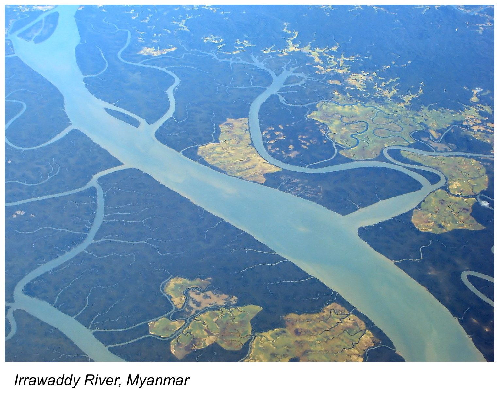

Note:
- Adult *Danionella cerebrum*, about 1 cm long
- Lives in the Irrawaddy river basin, Myanmar
- Stays small and transparent as an adult

---

  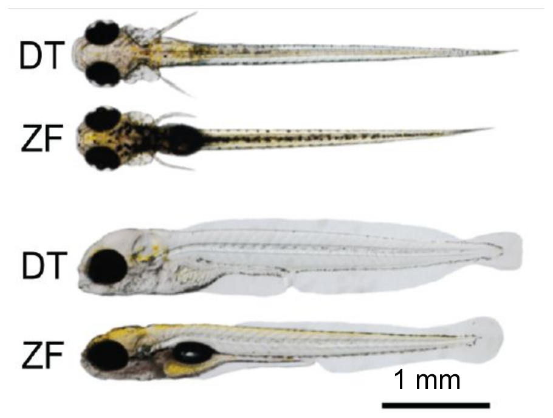
  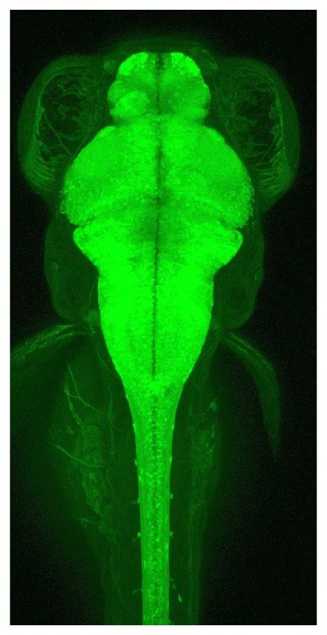
  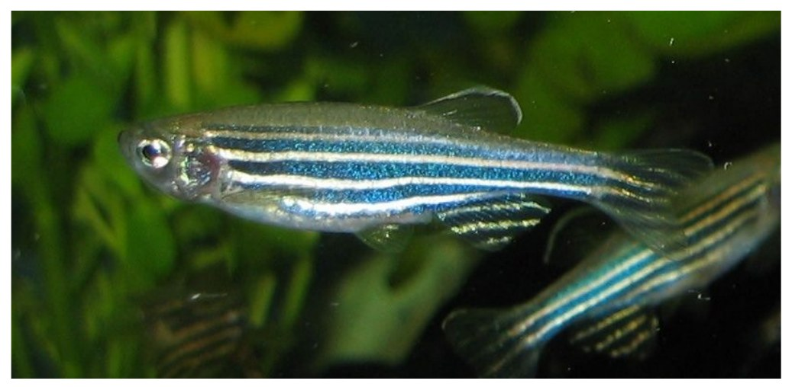

  <ul style="width:46%; font-size:0.62em;">
    <li>Smallest vertebrate brain</li>
    <li>Transparent, close to zebrafish</li>
    <li>Pan-neuronal GCaMP6s</li>
  </ul>
  Paper: Transparent *Danionella translucida* as a genetically tractable vertebrate brain model | Schulze et al., *Nature Methods*, 2018

Note:
- Left: *Danionella* (DT) vs zebrafish (ZF) larvae, dorsal and lateral views: zebrafish is already pigmented, *Danionella* is clear
- Middle: whole-brain GCaMP expression in *Danionella*. Right: adult zebrafish, for comparison
- (DT label: the lab strain was formerly classified as *D. translucida*)
- Manon's slide also credits the larva image to Gokul R. (2022), *Evolutionary divergence of locomotion in two related vertebrate species*: check which one is the source

---

## Light-sheet microscopy and virtual reality

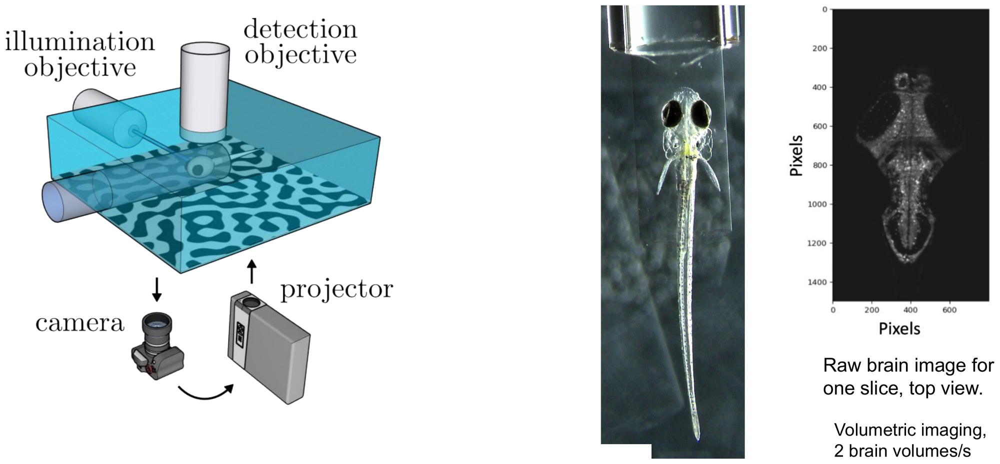

Footnote: Setup from Leonardo Demarchi's PhD: *Visuomotor control in Danionella cerebrum*

Note:
- Whole-brain light-sheet imaging, 2 brain volumes per second
- Landmark patterns are projected below the fish; tail tracked by a camera
- Middle: head embedded in agarose in a capillary, tail free. Right: raw image of one slice, top view

---

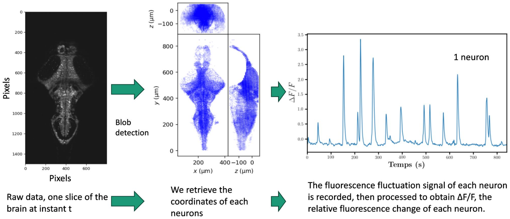

Note:
- Raw data: one slice of the brain at instant t
- Blob detection gives the coordinates of each neuron (~10⁴ per fish)
- The fluorescence of each neuron is extracted and converted to ΔF/F

---

## Screening for head direction cells

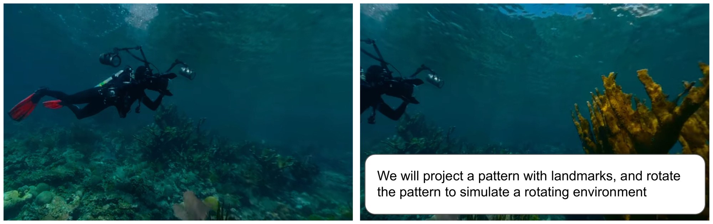

Visual landmarks anchor the HD system

Note:
- In a new environment, the HD system anchors itself to surrounding cues; vision is a major source. As you move, cues shift and act as landmarks
- Idea: instead of turning the fish, turn the world
- We project a pattern with landmarks and rotate it to simulate a rotating environment

---

## Rotate the world, not the fish

  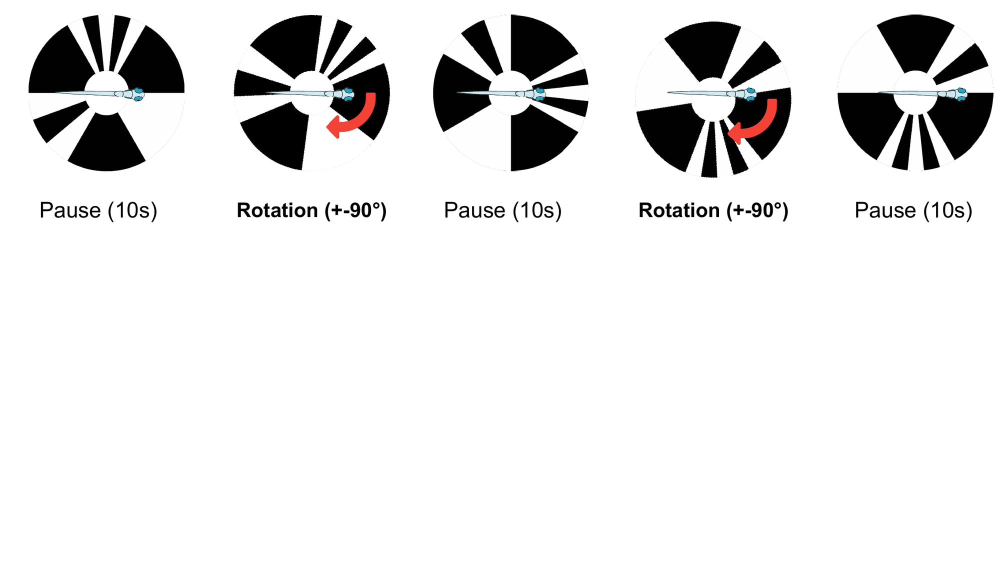
  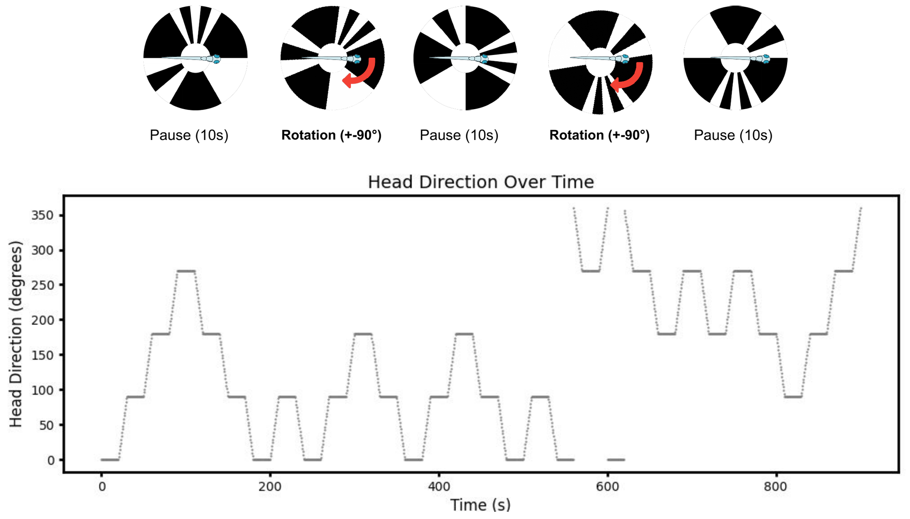
  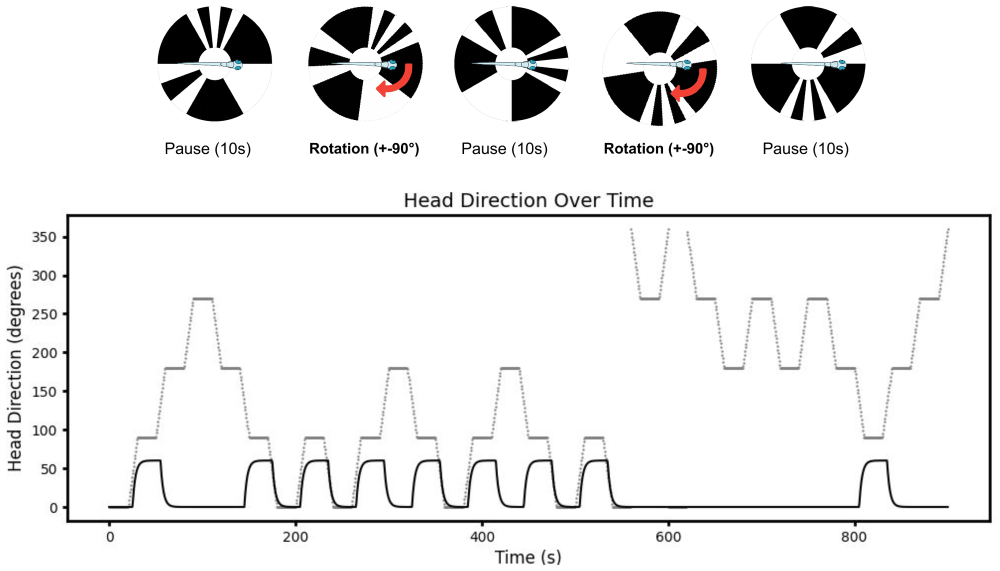

Open loop · ±90° rotations · 10 s pauses

Note:
- Open loop: the fish's movements do not change the projected pattern
- Fictive heading = orientation of the pattern (grey trace)
- For each angle, build a regressor: 1 when the fish "faces" that angle (black, here 90°), 0 otherwise. Correlate each neuron with each regressor

---

## Single neurons are tuned to fictive heading

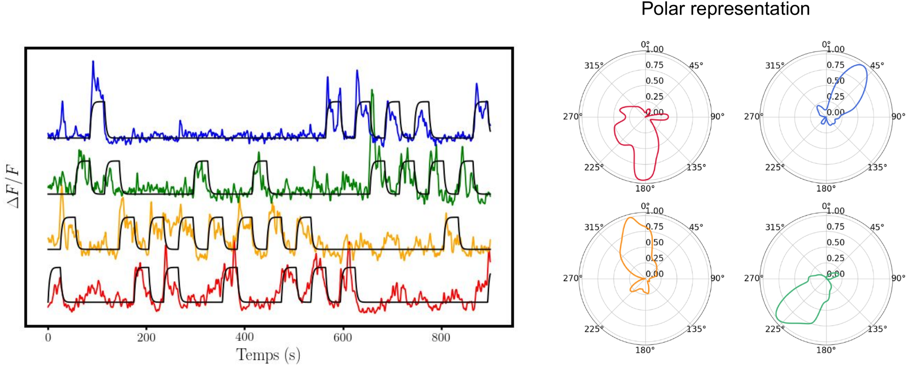

Note:
- Left: the best-correlated neuron for 0°, 90°, 180° and 270°, each with its regressor (black)
- Right: polar tuning curves of the same neurons: a single preferred direction each, like rodent HD cells
- But in open loop the eyes see the same scene: a purely visual neuron could do this too

---

## Decoding heading from the population

  

    
1. Tuning curves

    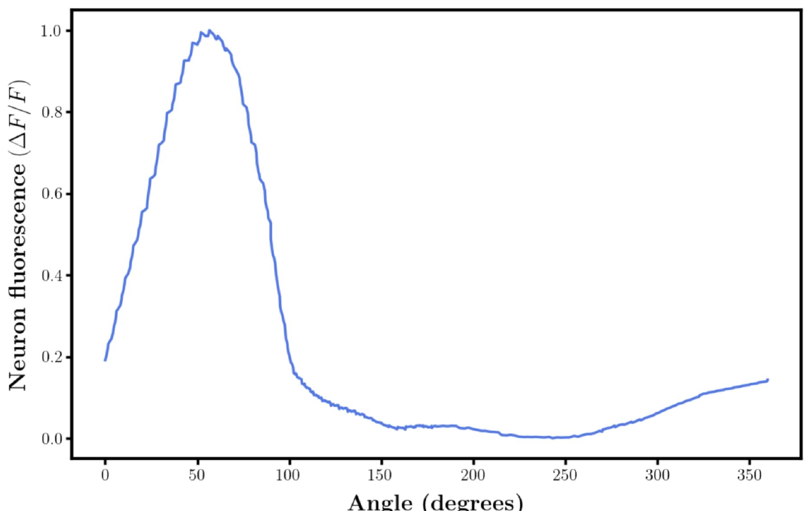
  

  

    
2. Preferred directions

    $$\theta_{\mathrm{pref},n} = \arg \left(\sum_t r_n(t) e^{j\theta_t}\right)$$
    
why not $\arg \left( \sum_\theta \bar{r}_n(\theta) e^{j\theta}  \right)$ ?

  

Note:
- $r_n(t)$: firing rate (ΔF/F) of neuron $n$; $\theta_t$: imposed heading at time $t$
- The preferred direction is the circular mean of the heading, weighted by activity

---

  
3. Population vector

  $$\vec v(t) = \sum_n r_n(t)\, e^{\,i\,\theta_{\mathrm{pref},n}}$$

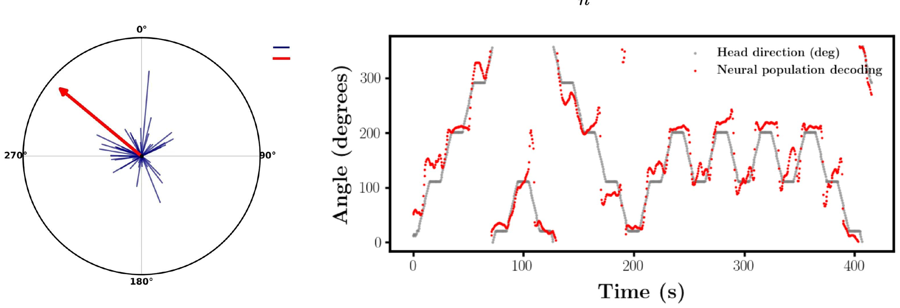

Note:
- Left: each neuron votes for its preferred direction, weighted by its current activity (blue); the sum is the population vector (red)
- Right: decoded heading (red) vs imposed heading (grey): the population tracks the fictive heading

---

## Experiment: landmark rotations, then darkness

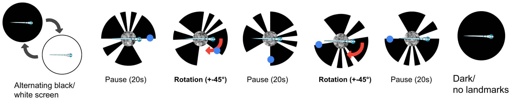

  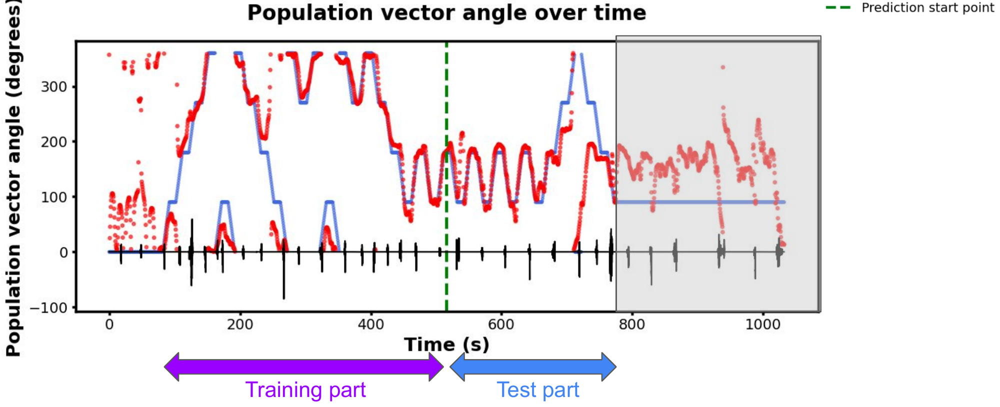
  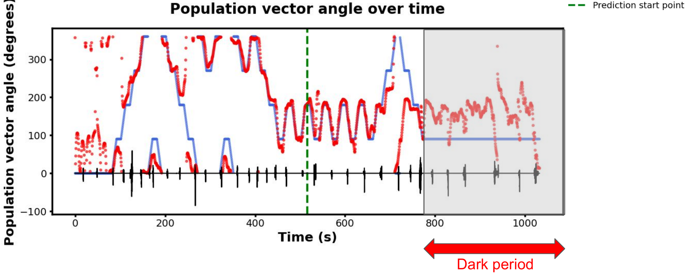

Note:
- Protocol: alternating black/white flashes first, then ±45° rotations with 20 s pauses, then darkness (no landmarks)
- The flashes identify purely luminance-driven visual neurons, which are removed
- Training part (purple): preferred directions are estimated. Test part (blue): prediction on held-out data. Dashed green line: prediction start
- Then: what happens to the decoded heading in the dark period (grey)?

---

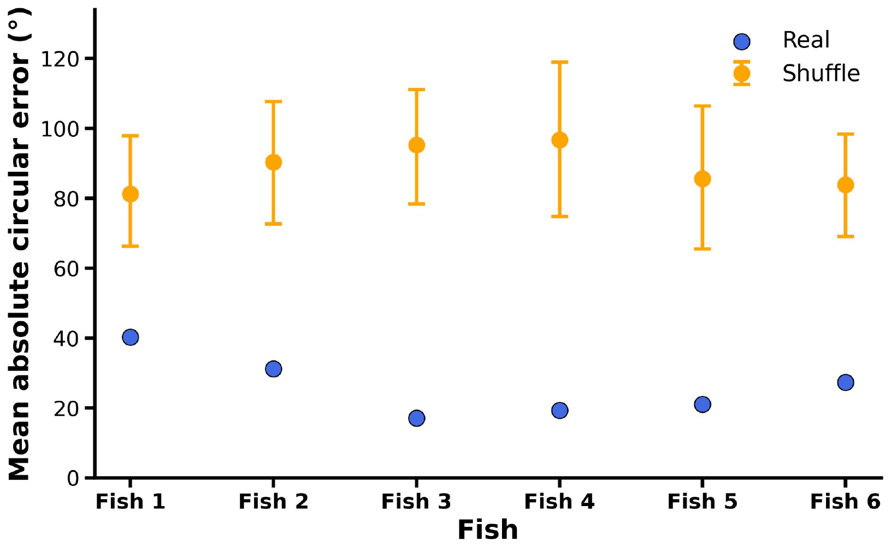

- Error far below shuffle in every fish (N = 6)
- Also found with simpler protocols (N = 15)

Note:
- y axis: mean absolute circular error on the test part. Blue: real data; orange: shuffle (mean ± s.d.)
- Chance level is ~90°; real data is ~20–40°

---

## What happens in the dark?

  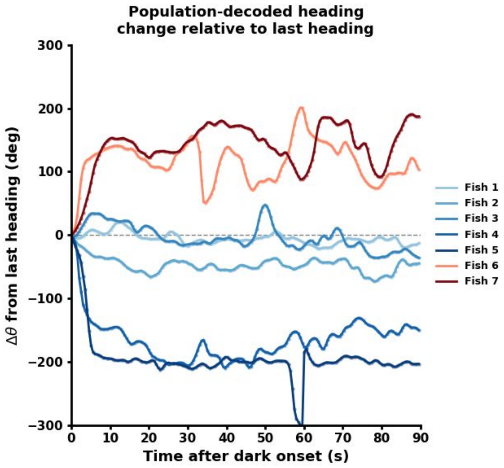
  

    <ul style="font-size:0.62em;">
      <li>Expected: bump holds the last heading, slow drift</li>
    </ul>
    <ul class="fragment" style="font-size:0.62em;">
      <li>Observed: stable, or a 180–200° jump</li>
    </ul>
    <ul class="fragment" style="font-size:0.62em;">
      <li>Jumps follow the last rotation (+90°, −90°)</li>
    </ul>
  

Note:
- y axis: decoded heading after dark onset, relative to the last imposed heading; one line per fish (N = 7)
- If these were purely visual neurons, the decoded heading would be meaningless in the dark
- Drift in the dark is also seen for rodent HD cells
- Preliminary: only 7 fish

---

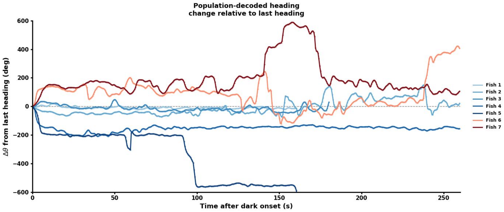

Hypothesis: self-motion moves the bump

Note:
- Same plot over 250 s
- Long stable plateaus, separated by sudden steps

---

  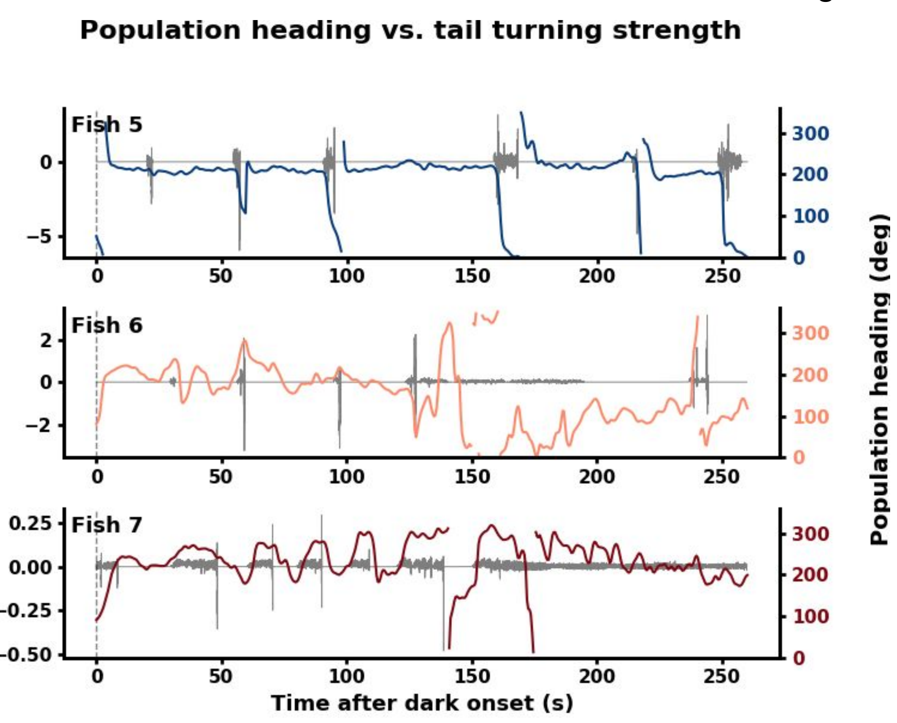
  <ul style="width:40%; font-size:0.62em;">
    <li>Active in the dark</li>
    <li>Stable heading for minutes</li>
    <li>Steps with tail movements?</li>
  </ul>

Note:
- Three fish: tail turning strength (grey) and decoded heading (colour), after dark onset
- Several steps in the decoded heading coincide with tail bouts: a hint of angular path integration
- Needs to be quantified

---

## Remapping

  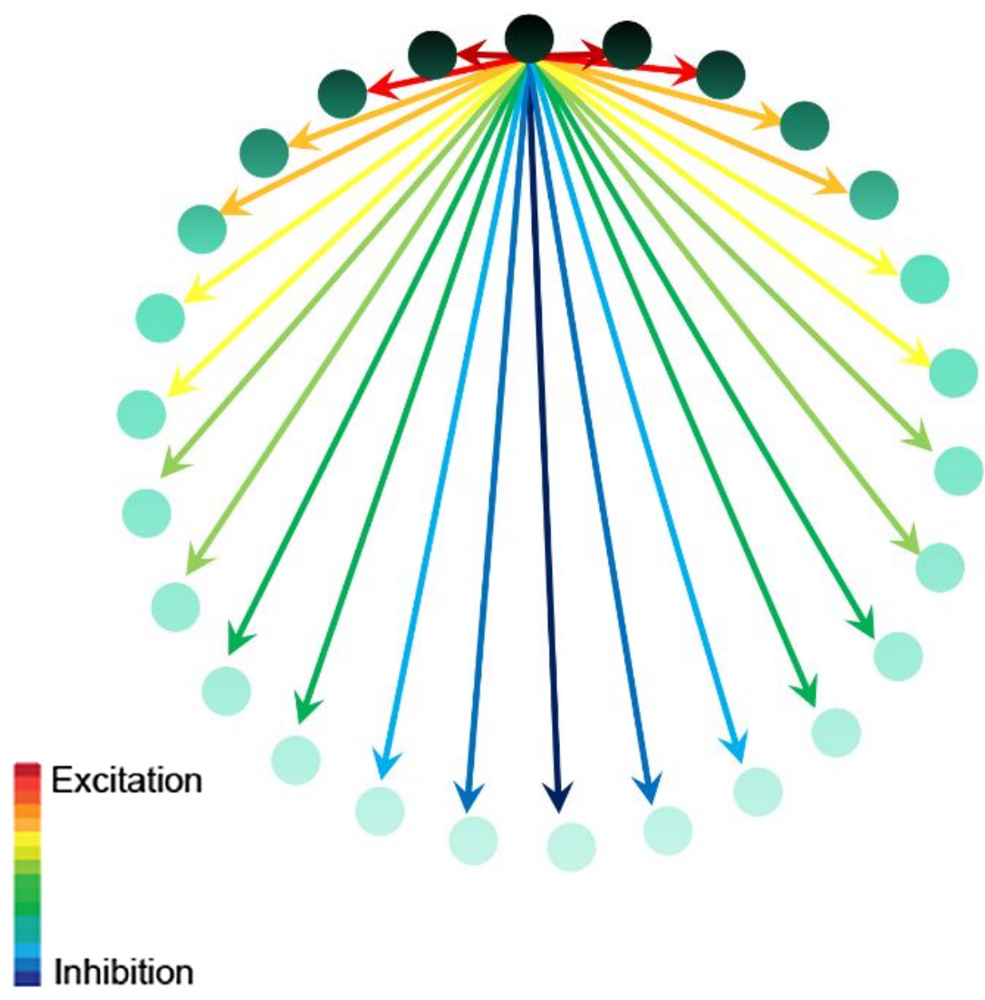
  <ul style="width:50%; font-size:0.65em;">
    <li>Same cells in a new environment?</li>
    <li>Do all preferred directions shift together?</li>
  </ul>

Note:
- In a ring attractor, a new environment rotates the whole ring: every preferred direction shifts by the same angle
- Purely visual neurons have no reason to shift together
- Angles of a pattern are arbitrary: what matters is whether the population keeps its relative organisation

---

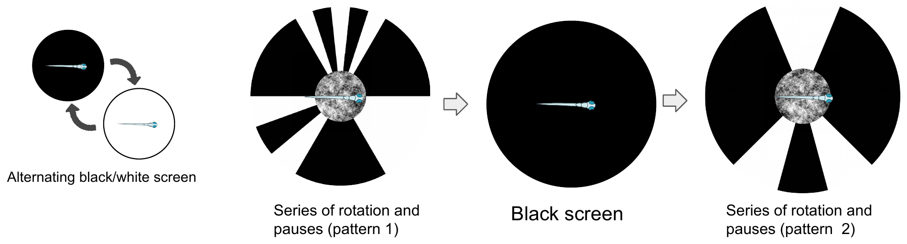

  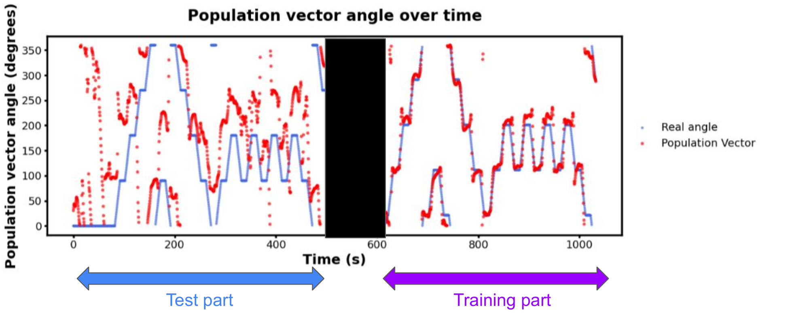
  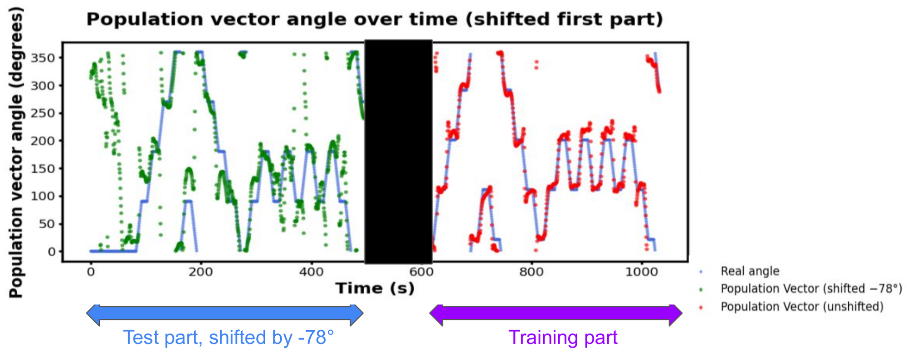

Note:
- Protocol: flashes, rotations with pattern 1, black screen, rotations with pattern 2
- Training on pattern 2 (right). Tested on pattern 1 (left), the decoder fails
- Shifting the test part by a single angle, −78°, realigns it (green)

---

## Do all cells shift together?

  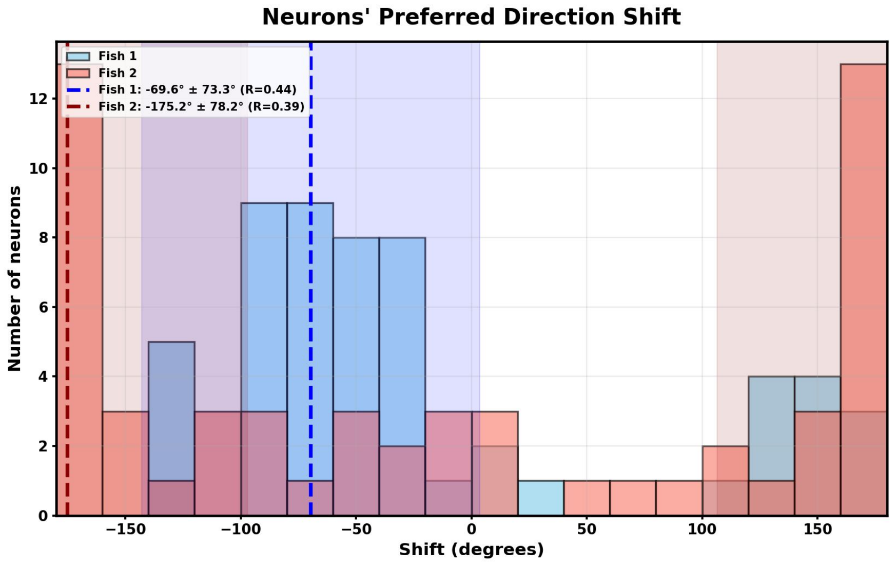
  <ul style="width:38%; font-size:0.62em;">
    <li>Expected: one common shift</li>
    <li>Fish 1: −69.6° per neuron vs −78° for the population</li>
    <li>~50 cells in both environments (N = 3)</li>
  </ul>

Note:
- Histogram of the preferred-direction shift between pattern 1 and pattern 2. Fish 1: −69.6° ± 73.3° (R = 0.44); fish 2: −175.2° ± 78.2° (R = 0.39). Fish 2's peak sits at ±180° and wraps around
- Most neurons shift by the same amount in 2 of 3 fish
- Outliers explain the large standard deviation; this criterion could be used to remove neurons that are not part of the circuit

---

## Where are these neurons?

  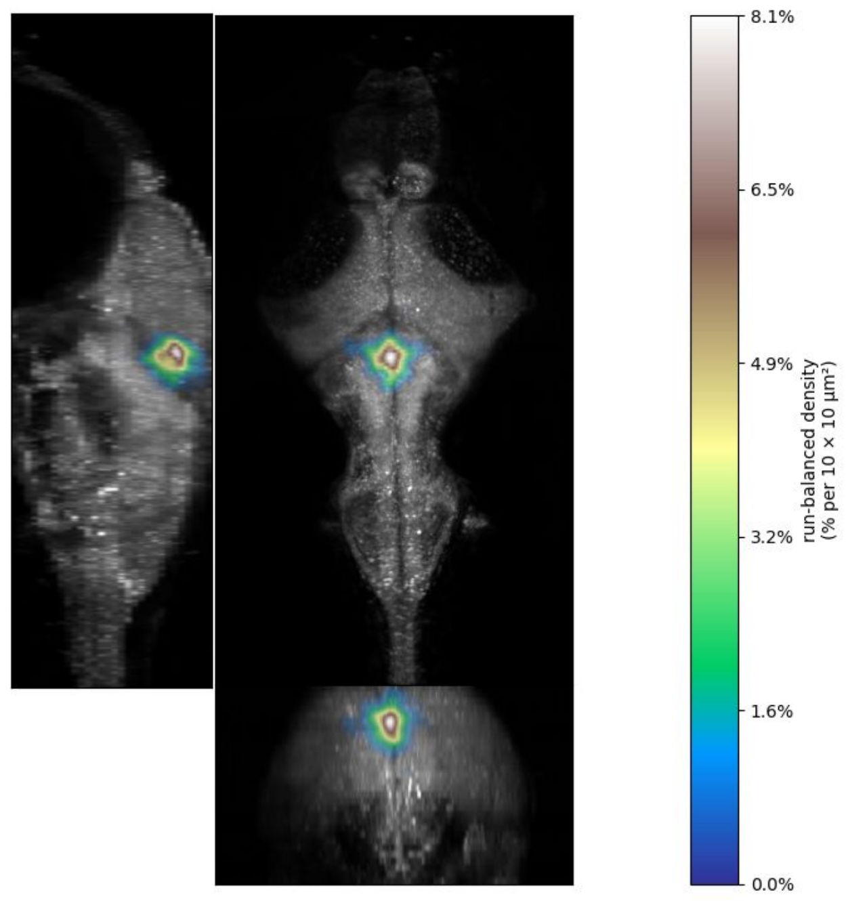
  <ul style="width:46%; font-size:0.65em;">
    <li>~50 neurons per fish, in the cerebellum (N ≈ 21)</li>
    <li>More dorsal than in zebrafish</li>
    <li class="fragment">Inhibitory or excitatory?</li>
  </ul>

Note:
- Density map of angle-correlated neurons across fish, registered to a common brain
- Zebrafish r1π neurons are GABAergic, in ventral rhombomere 1 (Petrucco 2023)
- The zebrafish HD cells are inhibitory: are ours?

---

## Excitatory or inhibitory? A gad1b line

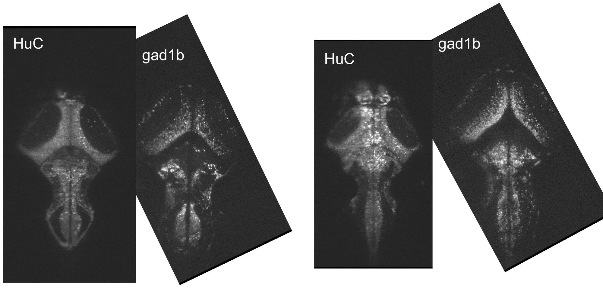

Note:
- HuC (elavl3): all neurons. gad1b: GABAergic (inhibitory) neurons, the line analogous to the one used for the zebrafish HD study
- Next: image the gad1b line with the same protocol

---

## Summary and next steps

  

    <h3>So far</h3>
    <ul style="font-size:0.65em;">
      <li>Heading-tuned neurons in the cerebellum</li>
      <li>Heading held in the dark for minutes</li>
      <li>Coherent remapping (N = 2–3)</li>
    </ul>
  

  

  

    <h3>Next</h3>
    <ul style="font-size:0.65em;">
      <li>Same protocol across development, from 7 dpf</li>
      <li>elavl3 vs gad1b, vs zebrafish</li>
      <li>Track network and morphology over time</li>
    </ul>
  

Note:
- Manon's seminar ends on the localisation and cell type question; next steps taken from her "Future directions" backup slide
- Key open question: when does the ring appear during development, and when do visual and self-motion inputs become aligned?

---

<!-- .slide: data-background-color="#000000" -->

# Supplementary

---

## Continuous rotation: a ring in state space

  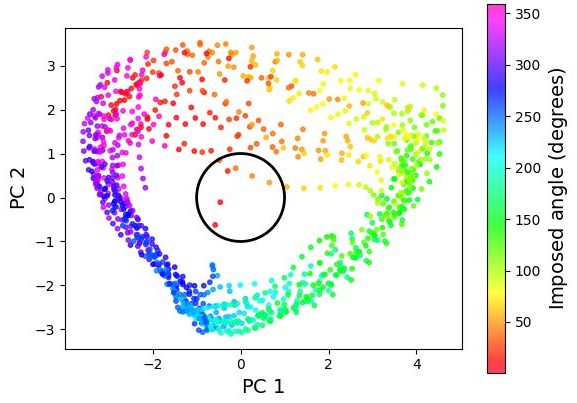
  

    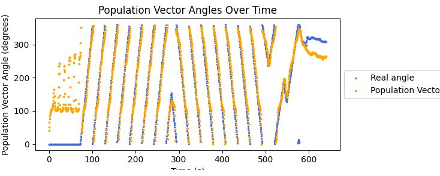
    <ul style="font-size:0.65em;">
      <li>Continuous rotation, open loop (N = 2)</li>
      <li>First two PCs trace a ring</li>
    </ul>
  

Note:
- From Manon's second-year TAC
- Same signature as the zebrafish r1π network (Petrucco 2023, Fig. 1): a 1D circular manifold

---

## gad1b line: first recordings

  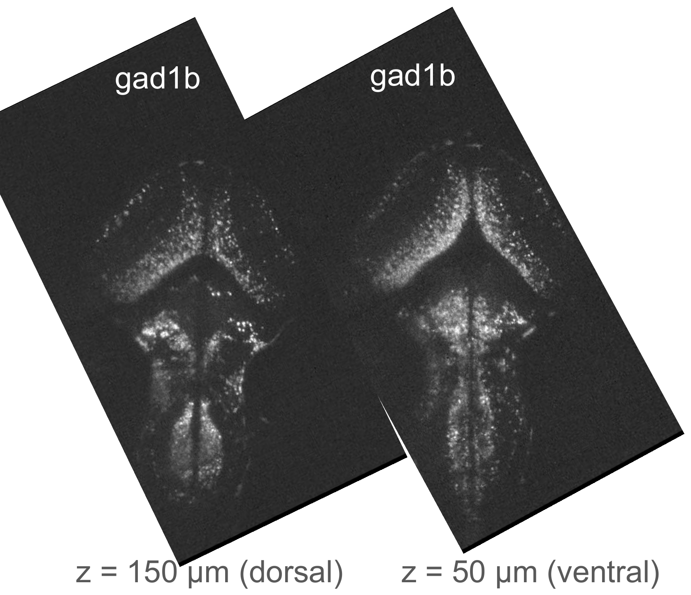
  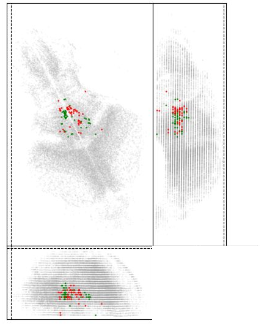

<ul style="font-size:0.65em;">
  <li>Strong ventral activity</li>
  <li>Left/right rotation neurons found</li>
  <li>No angle-correlated neurons yet (N = 2)</li>
</ul>

Note:
- From Manon's second-year TAC
- Right: neurons correlated with leftward (red) and rightward (green) rotations of the pattern

---

## Closed loop: getting the fish to steer

  <figure style="margin:0;">
    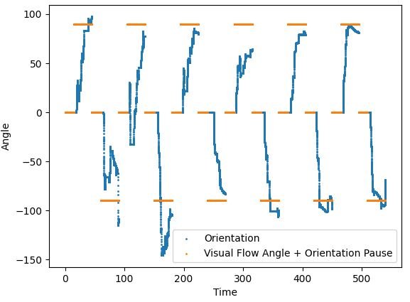
    <figcaption style="font-size:0.45em; margin-top:6px;">Follows the target</figcaption>
  </figure>
  <figure style="margin:0;">
    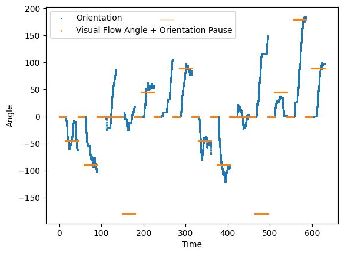
    <figcaption style="font-size:0.45em; margin-top:6px;">Short bursts</figcaption>
  </figure>

<ul style="font-size:0.65em;">
  <li>3 of 39 larvae follow the visual flow</li>
  <li>Suspect: lateral IR light. Next: behaviour-only rig</li>
</ul>

Note:
- From Manon's second-year TAC
- Blue: fish orientation in VR; orange: target orientation set by the visual flow
- ~50% of larvae swim continuously, but only 3/39 align with the visual flow
